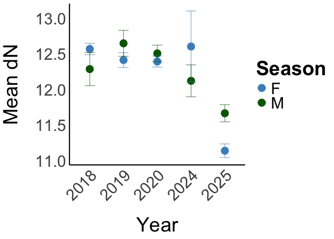

# SIA exploratory


## Load packages and save formatting preferences

## Input data and merge into one

``` r
lab_outputs<-read.csv("Lab_outputs.csv",header=TRUE)
head(lab_outputs)
```

      Lead Sample_type Sample_name     N      C N_wt C_wt C_N_wt  X X.1 X.2 X.3
    1   RB       Blood       RBC1a 11.11 -16.23 13.4 48.7    3.6 NA  NA  NA  NA
    2   RB       Blood       RBC3b 11.58 -16.16 14.2 48.6    3.4 NA  NA  NA  NA
    3   RB       Blood       RBC4a 10.93 -15.70 13.8 47.7    3.5 NA  NA  NA  NA
    4   RB       Blood       RBC5a 11.23 -17.09 14.0 48.3    3.4 NA  NA  NA  NA
    5   RB       Blood       RBC7a 10.94 -17.65 13.9 48.3    3.5 NA  NA  NA  NA
    6   RB       Blood       RBC8a 11.87 -15.89 14.2 48.6    3.4 NA  NA  NA  NA

``` r
lab_outputs <- lab_outputs[, 1:(ncol(lab_outputs) - 4)]

metadata<-read.csv("Metadata.csv",header=TRUE)
metadata <- metadata[, 1:(ncol(metadata) - 88)]

lab_outputs <- lab_outputs %>%
  mutate(Sample_ID = case_when(
    Sample_type == "Blood" ~ sub("^RBC([0-9]+)[a-zA-Z]$", "\\1", Sample_name), 
    Sample_type == "Skin"  ~ Sample_name,                       
    TRUE ~ Sample_name
  ))
head(lab_outputs)
```

      Lead Sample_type Sample_name     N      C N_wt C_wt C_N_wt Sample_ID
    1   RB       Blood       RBC1a 11.11 -16.23 13.4 48.7    3.6         1
    2   RB       Blood       RBC3b 11.58 -16.16 14.2 48.6    3.4         3
    3   RB       Blood       RBC4a 10.93 -15.70 13.8 47.7    3.5         4
    4   RB       Blood       RBC5a 11.23 -17.09 14.0 48.3    3.4         5
    5   RB       Blood       RBC7a 10.94 -17.65 13.9 48.3    3.5         7
    6   RB       Blood       RBC8a 11.87 -15.89 14.2 48.6    3.4         8

``` r
blood_labs <- lab_outputs %>%
  filter(Sample_type == "Blood") %>%
  mutate(Sample_ID = as.integer(Sample_ID)) %>%
  left_join(metadata %>% select(Blood_RB, Sex, Life_stage, Date, Mass),
            by = c("Sample_ID" = "Blood_RB")) %>%
  mutate(Sample_ID = as.character(Sample_ID))

skin_labs <- lab_outputs %>%
  filter(Sample_type == "Skin") %>%
  left_join(metadata %>% select(Biopsy_no, Genetics_no, Sex, Life_stage, Date, Mass) %>%
              pivot_longer(c(Biopsy_no, Genetics_no), values_to = "Sample_ID") %>%
              select(-name),
            by = "Sample_ID")

SIA_full <- bind_rows(blood_labs, skin_labs) %>%
  select(-Sample_ID)

SIA_full <- SIA_full %>%
  mutate(
    Month = month(Date),
    Season = if_else(Month %in% 11:12 | Month %in% 1:4, "Wet", "Dry")
  )
SIA_full$Date <- as.Date(SIA_full$Date, format = "%d/%m/%Y")
SIA_full$Year <- year(SIA_full$Date)
SIA_full$Year <- as.factor(SIA_full$Year)
SIA_full <- SIA_full %>%
  mutate(Mass = as.numeric(Mass))

head(SIA_full)
```

      Lead Sample_type Sample_name     N      C N_wt C_wt C_N_wt Sex Life_stage
    1   RB       Blood       RBC1a 11.11 -16.23 13.4 48.7    3.6   M      Adult
    2   RB       Blood       RBC3b 11.58 -16.16 14.2 48.6    3.4   M      Adult
    3   RB       Blood       RBC4a 10.93 -15.70 13.8 47.7    3.5   M      Adult
    4   RB       Blood       RBC5a 11.23 -17.09 14.0 48.3    3.4   F      Adult
    5   RB       Blood       RBC7a 10.94 -17.65 13.9 48.3    3.5   M      Adult
    6   RB       Blood       RBC8a 11.87 -15.89 14.2 48.6    3.4   M      Adult
            Date Mass Month Season Year
    1 2024-08-12   65     8    Dry 2024
    2 2024-08-15   52     8    Dry 2024
    3 2024-08-16   70     8    Dry 2024
    4 2024-08-17   61     8    Dry 2024
    5 2024-08-17   73     8    Dry 2024
    6 2024-08-18   60     8    Dry 2024

## Summmary table by sample type

``` r
SIA_full %>%
  group_by(Sample_type, Sex, Season) %>%
  summarise(
    mean_C = round(mean(C, na.rm = TRUE), 2),
    sd_C   = round(sd(C, na.rm = TRUE), 2),
    mean_N = round(mean(N, na.rm = TRUE), 2),
    sd_N   = round(sd(N, na.rm = TRUE), 2),
    n      = n(),
    .groups = "drop"
  )
```

    # A tibble: 8 × 8
      Sample_type Sex   Season mean_C  sd_C mean_N  sd_N     n
      <chr>       <chr> <chr>   <dbl> <dbl>  <dbl> <dbl> <int>
    1 Blood       F     Dry     -16.7  0.32   10.6  0.38    13
    2 Blood       F     Wet     -16.6  0.23   10.7  0.37    14
    3 Blood       M     Dry     -16.3  0.6    11.4  0.31    15
    4 Blood       M     Wet     -16.4  0.59   11.0  0.5      9
    5 Skin        F     Dry     -16.6  0.79   12.4  0.46    73
    6 Skin        F     Wet     -15.6  1.05   12.0  0.8     21
    7 Skin        M     Dry     -16.1  1.05   12.5  0.65    45
    8 Skin        M     Wet     -15.3  1.34   12.2  0.68    15

## When were samples taken?

``` r
SIA_full <- SIA_full %>%
  mutate(Month_Year = format(Date, "%m-%y")) %>%
  mutate(Month_Year = factor(Month_Year, levels = unique(Month_Year[order(Date)])))
SIA_full %>%
  ggplot(aes(x = Month_Year)) +
  geom_bar(fill = "#4A90C4") +
  labs(
    x = "Trip (Month-Year)",
    y = "Number of samples"
  ) +
  my_theme +
  theme(axis.text.x = element_text(angle = 45, hjust = 1))
```


## Exploring inter-annual trends in biopsy data

``` r
SIA_biopsy<-SIA_full[SIA_full$Sample_type=="Skin",]
```

## Plot for SIA

``` r
SIA_biopsy %>%
  select(C, N, Mass, Season) %>%
  ggpairs()
```

    Warning: Removed 15 rows containing missing values
    Removed 15 rows containing missing values

    Warning: Removed 15 rows containing missing values or values outside the scale range
    (`geom_point()`).
    Removed 15 rows containing missing values or values outside the scale range
    (`geom_point()`).

    Warning: Removed 15 rows containing non-finite outside the scale range
    (`stat_density()`).

    Warning: Removed 15 rows containing non-finite outside the scale range
    (`stat_boxplot()`).

    `stat_bin()` using `bins = 30`. Pick better value `binwidth`.
    `stat_bin()` using `bins = 30`. Pick better value `binwidth`.
    `stat_bin()` using `bins = 30`. Pick better value `binwidth`.

    Warning: Removed 15 rows containing non-finite outside the scale range
    (`stat_bin()`).


``` r
SIA_full %>%
  group_by(Year, Sex) %>%
  summarise(mean_C = mean(C, na.rm = TRUE),
            se_C = sd(C, na.rm = TRUE) / sqrt(n()),
            n = n(),
            .groups = "drop") %>%
  ggplot(aes(x = Year, y = mean_C, colour = Sex, group = Sex)) +
  geom_point(size = 5) +
  geom_errorbar(aes(ymin = mean_C - se_C, ymax = mean_C + se_C), width = 0.3, alpha = 0.6)+
  scale_colour_manual(values = c("#4A90C4", "darkgreen")) +
  labs(
    x = "Year",
    y = "Mean dC",
    colour = "Season"
  ) +
  my_theme + 
  theme(axis.text.x = element_text(angle = 45, hjust = 1))
```


``` r
SIA_full %>%
  group_by(Year, Sex) %>%
  summarise(mean_N = mean(N, na.rm = TRUE),
            se_N = sd(N, na.rm = TRUE) / sqrt(n()),
            n = n(),
            .groups = "drop") %>%
  ggplot(aes(x = Year, y = mean_N, colour = Sex, group = Sex)) +
  geom_point(size = 5) +
  geom_errorbar(aes(ymin = mean_N - se_N, ymax = mean_N + se_N), width = 0.3, alpha = 0.6)+
  scale_colour_manual(values = c("#4A90C4", "darkgreen")) +  
  labs(
    x = "Year",
    y = "Mean dN",
    colour = "Season"
  ) +
  my_theme + 
  theme(axis.text.x = element_text(angle = 45, hjust = 1))
```



## Isoscape plots by year

``` r
SIA_biopsy %>%
  ggplot(aes(x = C, y = N, colour = Season, shape = Sex)) +
  geom_point(size = 3, alpha = 0.7) +
  facet_wrap(~Year)
```


``` r
first.plot <- ggplot(data = SIA_biopsy, 
                   mapping = aes(x = C, 
                                 y = N)) + 
  geom_point(aes(color = Year, shape = Year), size = 5) +
  ylab(expression(paste(delta^{15}, "N (\u2030)"))) +
  xlab(expression(paste(delta^{13}, "C (\u2030)"))) + 
  theme(text = element_text(size=20))

classic.first.plot <- first.plot + theme_classic() + 
  theme(text = element_text(size=35)) + 
  coord_equal() + 
  theme(axis.ticks.length = unit(-0.2, "cm")) +
  scale_colour_viridis_d(end = 0.9)
print(classic.first.plot)
```


``` r
fbmeans <- SIA_biopsy %>% 
  group_by(Year) %>% 
  summarise(count = n(),
            mC = mean(C), 
            sdC = sd(C), 
            mN = mean(N), 
            sdN = sd(N) )
print(fbmeans)
```

    # A tibble: 5 × 6
      Year  count    mC   sdC    mN   sdN
      <fct> <int> <dbl> <dbl> <dbl> <dbl>
    1 2018     37 -16.7 0.849  12.4 0.675
    2 2019     26 -16.5 0.602  12.5 0.464
    3 2020     41 -16.9 0.651  12.4 0.413
    4 2024     10 -14.9 0.610  12.9 0.314
    5 2025     40 -15.1 0.750  11.9 0.598

``` r
second.plot <- first.plot + 
  geom_errorbar(data = fbmeans, 
                mapping = aes(x = mC, y = mN,
                              ymin = mN - 1.96*sdN, 
                              ymax = mN + 1.96*sdN), 
                width = 0)+
  geom_errorbarh(data = fbmeans, 
                 mapping = aes(x = mC, y = mN,
                               xmin = mC - 1.96*sdC,
                               xmax = mC + 1.96*sdC),
                 height = 0) + 
  geom_point(data = fbmeans, aes(x = mC, 
                                 y = mN,
                                 fill = Year), 
             color = "black", shape = 22, size = 5,
             alpha = 0.7, show.legend = FALSE) + 
  coord_equal()
```

    Warning: `geom_errorbarh()` was deprecated in ggplot2 4.0.0.
    ℹ Please use the `orientation` argument of `geom_errorbar()` instead.

``` r
print(second.plot)
```

    `height` was translated to `width`.


``` r
p.ell <- 0.95

ellipse.plot3 <- first.plot + 
  stat_ellipse(aes(group =Year, 
                   fill = Year, 
                   color = Year), 
               alpha = 0.25, 
               level = p.ell,
               type = "t",
               geom = "polygon")
print(ellipse.plot3)
```


## Isoscape plots by sex

``` r
first.plot <- ggplot(data = SIA_biopsy, 
                   mapping = aes(x = C, 
                                 y = N)) + 
  geom_point(aes(color = Sex, shape = Sex), size = 5) +
  ylab(expression(paste(delta^{15}, "N (\u2030)"))) +
  xlab(expression(paste(delta^{13}, "C (\u2030)"))) + 
  theme(text = element_text(size=20))

classic.first.plot <- first.plot + theme_classic() + 
  theme(text = element_text(size=35)) + 
  coord_equal() + 
  theme(axis.ticks.length = unit(-0.2, "cm")) +
  scale_colour_viridis_d(end = 0.9)
print(classic.first.plot)
```


``` r
fbmeans <- SIA_biopsy %>% 
  group_by(Sex) %>% 
  summarise(count = n(),
            mC = mean(C), 
            sdC = sd(C), 
            mN = mean(N), 
            sdN = sd(N) )
print(fbmeans)
```

    # A tibble: 2 × 6
      Sex   count    mC   sdC    mN   sdN
      <chr> <int> <dbl> <dbl> <dbl> <dbl>
    1 F        94 -16.4 0.958  12.3 0.576
    2 M        60 -15.9 1.16   12.4 0.663

``` r
second.plot <- first.plot + 
  geom_errorbar(data = fbmeans, 
                mapping = aes(x = mC, y = mN,
                              ymin = mN - 1.96*sdN, 
                              ymax = mN + 1.96*sdN), 
                width = 0)+
  geom_errorbarh(data = fbmeans, 
                 mapping = aes(x = mC, y = mN,
                               xmin = mC - 1.96*sdC,
                               xmax = mC + 1.96*sdC),
                 height = 0) + 
  geom_point(data = fbmeans, aes(x = mC, 
                                 y = mN,
                                 fill = Sex), 
             color = "black", shape = 22, size = 5,
             alpha = 0.7, show.legend = FALSE) + 
  coord_equal()
print(second.plot)
```

    `height` was translated to `width`.


``` r
p.ell <- 0.95

ellipse.plot3 <- first.plot + 
  stat_ellipse(aes(group =Sex, 
                   fill = Sex, 
                   color = Sex), 
               alpha = 0.25, 
               level = p.ell,
               type = "t",
               geom = "polygon")
print(ellipse.plot3)
```


## Isoscape plots by year + sex

``` r
first.plot <- ggplot(data = SIA_biopsy, 
                   mapping = aes(x = C, 
                                 y = N)) + 
  geom_point(aes(color = Year), size = 5) +
  facet_wrap(~Sex)+
  ylab(expression(paste(delta^{15}, "N (\u2030)"))) +
  xlab(expression(paste(delta^{13}, "C (\u2030)"))) + 
  theme(text = element_text(size=20))

classic.first.plot <- first.plot + theme_classic() + 
  theme(text = element_text(size=35)) + 
  coord_equal() + 
  theme(axis.ticks.length = unit(-0.2, "cm")) +
  scale_colour_viridis_d(end = 0.9)
print(classic.first.plot)
```


``` r
fbmeans <- SIA_biopsy %>% 
  group_by(Year, Sex) %>% 
  summarise(count = n(),
            mC = mean(C), 
            sdC = sd(C), 
            mN = mean(N), 
            sdN = sd(N) )
```

    `summarise()` has regrouped the output.
    ℹ Summaries were computed grouped by Year and Sex.
    ℹ Output is grouped by Year.
    ℹ Use `summarise(.groups = "drop_last")` to silence this message.
    ℹ Use `summarise(.by = c(Year, Sex))` for per-operation grouping
      (`?dplyr::dplyr_by`) instead.

``` r
print(fbmeans)
```

    # A tibble: 10 × 7
    # Groups:   Year [5]
       Year  Sex   count    mC   sdC    mN   sdN
       <fct> <chr> <int> <dbl> <dbl> <dbl> <dbl>
     1 2018  F        21 -16.8 0.639  12.6 0.368
     2 2018  M        16 -16.4 1.04   12.3 0.929
     3 2019  F        19 -16.6 0.618  12.4 0.454
     4 2019  M         7 -16.5 0.596  12.6 0.482
     5 2020  F        27 -17.0 0.576  12.4 0.403
     6 2020  M        14 -16.8 0.780  12.5 0.436
     7 2024  F         3 -15.3 1.01   13.1 0.489
     8 2024  M         7 -14.7 0.266  12.9 0.237
     9 2025  F        24 -15.3 0.705  11.7 0.534
    10 2025  M        16 -14.9 0.780  12.1 0.594

``` r
second.plot <- first.plot + 
  geom_errorbar(data = fbmeans, 
                mapping = aes(x = mC, y = mN,
                              ymin = mN - 1.96*sdN, 
                              ymax = mN + 1.96*sdN), 
                width = 0)+
  geom_errorbarh(data = fbmeans, 
                 mapping = aes(x = mC, y = mN,
                               xmin = mC - 1.96*sdC,
                               xmax = mC + 1.96*sdC),
                 height = 0) + 
  geom_point(data = fbmeans, aes(x = mC, 
                                 y = mN,
                                 fill = Year), 
             color = "black", shape = 22, size = 5,
             alpha = 0.7, show.legend = FALSE) + 
  coord_equal()
print(second.plot)
```

    `height` was translated to `width`.


``` r
p.ell <- 0.95

ellipse.plot3 <- first.plot + 
  stat_ellipse(aes(group =Year, 
                   fill = Year, 
                   color = Year), 
               alpha = 0.25, 
               level = p.ell,
               type = "t",
               geom = "polygon")
print(ellipse.plot3)
```

    Too few points to calculate an ellipse


## Isoscape plots by year + sex + season

``` r
first.plot <- ggplot(data = SIA_biopsy, 
                   mapping = aes(x = C, 
                                 y = N)) + 
  geom_point(aes(color = Year, shape = Season), size = 5) +
  facet_wrap(~Sex)+
  ylab(expression(paste(delta^{15}, "N (\u2030)"))) +
  xlab(expression(paste(delta^{13}, "C (\u2030)"))) + 
  theme(text = element_text(size=20))

classic.first.plot <- first.plot + theme_classic() + 
  theme(text = element_text(size=35)) + 
  coord_equal() + 
  theme(axis.ticks.length = unit(-0.2, "cm")) +
  scale_colour_viridis_d(end = 0.9)
print(classic.first.plot)
```


``` r
fbmeans <- SIA_biopsy %>% 
  group_by(Year, Sex, Season) %>% 
  summarise(count = n(),
            mC = mean(C), 
            sdC = sd(C), 
            mN = mean(N), 
            sdN = sd(N) )
```

    `summarise()` has regrouped the output.
    ℹ Summaries were computed grouped by Year, Sex, and Season.
    ℹ Output is grouped by Year and Sex.
    ℹ Use `summarise(.groups = "drop_last")` to silence this message.
    ℹ Use `summarise(.by = c(Year, Sex, Season))` for per-operation grouping
      (`?dplyr::dplyr_by`) instead.

``` r
print(fbmeans)
```

    # A tibble: 14 × 8
    # Groups:   Year, Sex [10]
       Year  Sex   Season count    mC   sdC    mN   sdN
       <fct> <chr> <chr>  <int> <dbl> <dbl> <dbl> <dbl>
     1 2018  F     Dry       21 -16.8 0.639  12.6 0.368
     2 2018  M     Dry       16 -16.4 1.04   12.3 0.929
     3 2019  F     Dry       19 -16.6 0.618  12.4 0.454
     4 2019  M     Dry        7 -16.5 0.596  12.6 0.482
     5 2020  F     Dry       18 -17.2 0.460  12.3 0.353
     6 2020  F     Wet        9 -16.6 0.634  12.6 0.435
     7 2020  M     Dry        7 -17.0 0.458  12.6 0.352
     8 2020  M     Wet        7 -16.5 0.964  12.4 0.522
     9 2024  F     Dry        3 -15.3 1.01   13.1 0.489
    10 2024  M     Dry        7 -14.7 0.266  12.9 0.237
    11 2025  F     Dry       12 -15.8 0.633  11.9 0.294
    12 2025  F     Wet       12 -14.8 0.296  11.5 0.657
    13 2025  M     Dry        8 -15.4 0.547  12.2 0.343
    14 2025  M     Wet        8 -14.3 0.540  12.0 0.786

``` r
second.plot <- first.plot + 
  geom_errorbar(data = fbmeans, 
                mapping = aes(x = mC, y = mN,
                              ymin = mN - 1.96*sdN, 
                              ymax = mN + 1.96*sdN), 
                width = 0)+
  geom_errorbarh(data = fbmeans, 
                 mapping = aes(x = mC, y = mN,
                               xmin = mC - 1.96*sdC,
                               xmax = mC + 1.96*sdC),
                 height = 0) + 
  geom_point(data = fbmeans, aes(x = mC, 
                                 y = mN,
                                 fill = Year, shape = Season), 
             color = "black", shape = 22, size = 5,
             alpha = 0.7, show.legend = FALSE) + 
  coord_equal()
print(second.plot)
```

    `height` was translated to `width`.


``` r
p.ell <- 0.95

ellipse.plot3 <- first.plot + 
  stat_ellipse(aes(group =interaction(Year, Season), 
                   fill = Year, 
                   color = Year,
                   linetype = Season), 
               alpha = 0.25, 
               level = p.ell,
               type = "t",
               geom = "polygon")
print(ellipse.plot3)
```

    Too few points to calculate an ellipse


## Running models

``` r
SIA_biopsy %>% count(Year, Sex, Season)
```

       Year Sex Season  n
    1  2018   F    Dry 21
    2  2018   M    Dry 16
    3  2019   F    Dry 19
    4  2019   M    Dry  7
    5  2020   F    Dry 18
    6  2020   F    Wet  9
    7  2020   M    Dry  7
    8  2020   M    Wet  7
    9  2024   F    Dry  3
    10 2024   M    Dry  7
    11 2025   F    Dry 12
    12 2025   F    Wet 12
    13 2025   M    Dry  8
    14 2025   M    Wet  8

``` r
mC <- lm(C ~ Year + Sex + Season, data = SIA_biopsy)
summary(mC)
```


    Call:
    lm(formula = C ~ Year + Sex + Season, data = SIA_biopsy)

    Residuals:
         Min       1Q   Median       3Q      Max 
    -1.61248 -0.37543  0.02653  0.40345  1.92358 

    Coefficients:
                Estimate Std. Error  t value Pr(>|t|)    
    (Intercept) -16.7879     0.1162 -144.486  < 2e-16 ***
    Year2019      0.1643     0.1662    0.988  0.32458    
    Year2020     -0.5271     0.1576   -3.345  0.00105 ** 
    Year2024      1.6906     0.2320    7.286 1.80e-11 ***
    Year2025      1.1684     0.1644    7.106 4.79e-11 ***
    SexM          0.2876     0.1092    2.634  0.00933 ** 
    SeasonWet     0.7899     0.1455    5.427 2.31e-07 ***
    ---
    Signif. codes:  0 '***' 0.001 '**' 0.01 '*' 0.05 '.' 0.1 ' ' 1

    Residual standard error: 0.6458 on 147 degrees of freedom
    Multiple R-squared:  0.6465,    Adjusted R-squared:  0.6321 
    F-statistic: 44.81 on 6 and 147 DF,  p-value: < 2.2e-16

``` r
shapiro.test(resid(mC))
```


        Shapiro-Wilk normality test

    data:  resid(mC)
    W = 0.98838, p-value = 0.2309

``` r
par(mfrow = c(2,2))
plot(mC)
```


``` r
mN <- lm(N ~ Year + Sex + Season, data = SIA_biopsy)
summary(mN)
```


    Call:
    lm(formula = N ~ Year + Sex + Season, data = SIA_biopsy)

    Residuals:
         Min       1Q   Median       3Q      Max 
    -2.46858 -0.30632  0.01517  0.36810  1.52209 

    Coefficients:
                Estimate Std. Error t value Pr(>|t|)    
    (Intercept) 12.39775    0.09713 127.636  < 2e-16 ***
    Year2019     0.04818    0.13896   0.347 0.729286    
    Year2020     0.02794    0.13174   0.212 0.832314    
    Year2024     0.45467    0.19396   2.344 0.020410 *  
    Year2025    -0.54599    0.13746  -3.972 0.000111 ***
    SexM         0.11084    0.09126   1.214 0.226505    
    SeasonWet   -0.08469    0.12167  -0.696 0.487498    
    ---
    Signif. codes:  0 '***' 0.001 '**' 0.01 '*' 0.05 '.' 0.1 ' ' 1

    Residual standard error: 0.5399 on 147 degrees of freedom
    Multiple R-squared:  0.2551,    Adjusted R-squared:  0.2247 
    F-statistic: 8.391 on 6 and 147 DF,  p-value: 7.86e-08

``` r
shapiro.test(resid(mN))
```


        Shapiro-Wilk normality test

    data:  resid(mN)
    W = 0.94493, p-value = 9.865e-06

``` r
plot(mN)
```


