# SIA exploratory


## Load packages and save formatting preferences

## Input data and merge into one

``` r
lab_outputs<-read.csv("Lab_outputs.csv",header=TRUE)
head(lab_outputs)
```

      Lead Sample_type Sample_name     N      C N_wt C_wt C_N_wt  X X.1 X.2 X.3
    1   RB       Blood       RBC1a 11.11 -16.23 13.4 48.7    3.6 NA  NA  NA  NA
    2   RB       Blood       RBC3b 11.58 -16.16 14.2 48.6    3.4 NA  NA  NA  NA
    3   RB       Blood       RBC4a 10.93 -15.70 13.8 47.7    3.5 NA  NA  NA  NA
    4   RB       Blood       RBC5a 11.23 -17.09 14.0 48.3    3.4 NA  NA  NA  NA
    5   RB       Blood       RBC7a 10.94 -17.65 13.9 48.3    3.5 NA  NA  NA  NA
    6   RB       Blood       RBC8a 11.87 -15.89 14.2 48.6    3.4 NA  NA  NA  NA

``` r
lab_outputs <- lab_outputs[, 1:(ncol(lab_outputs) - 4)]

metadata<-read.csv("Metadata.csv",header=TRUE)
metadata <- metadata %>%
  mutate(Turtle_ID = row_number())

lab_outputs <- lab_outputs %>%
  mutate(Sample_ID = case_when(
    Sample_type == "Blood" ~ sub("^RBC([0-9]+)[a-zA-Z]$", "\\1", Sample_name), 
    Sample_type == "Skin"  ~ Sample_name,                       
    TRUE ~ Sample_name
  ))
head(lab_outputs)
```

      Lead Sample_type Sample_name     N      C N_wt C_wt C_N_wt Sample_ID
    1   RB       Blood       RBC1a 11.11 -16.23 13.4 48.7    3.6         1
    2   RB       Blood       RBC3b 11.58 -16.16 14.2 48.6    3.4         3
    3   RB       Blood       RBC4a 10.93 -15.70 13.8 47.7    3.5         4
    4   RB       Blood       RBC5a 11.23 -17.09 14.0 48.3    3.4         5
    5   RB       Blood       RBC7a 10.94 -17.65 13.9 48.3    3.5         7
    6   RB       Blood       RBC8a 11.87 -15.89 14.2 48.6    3.4         8

``` r
blood_labs <- lab_outputs %>%
  filter(Sample_type == "Blood") %>%
  mutate(Sample_ID = as.integer(Sample_ID)) %>%
  left_join(metadata %>% select(Blood_RB, Sex, Life_stage, Date, Mass, Adipose_perc,Turtle_ID, Latitude, Longitude),
            by = c("Sample_ID" = "Blood_RB")) %>%
  mutate(Sample_ID = as.character(Sample_ID))

skin_labs <- lab_outputs %>%
  filter(Sample_type == "Skin") %>%
  left_join(metadata %>% select(Biopsy_no, Genetics_no, Sex, Life_stage, Date, Mass,Adipose_perc,Turtle_ID, Latitude, Longitude) %>%
              pivot_longer(c(Biopsy_no, Genetics_no), values_to = "Sample_ID") %>%
              select(-name),
            by = "Sample_ID")

SIA_full <- bind_rows(blood_labs, skin_labs) %>%
  select(-Sample_ID)

SIA_full <- SIA_full %>%
  mutate(
    Month = month(Date),
    Season = if_else(Month %in% 11:12 | Month %in% 1:4, "Wet", "Dry")
  )
SIA_full$Date <- as.Date(SIA_full$Date, format = "%d/%m/%Y")
SIA_full$Year <- year(SIA_full$Date)
SIA_full$Year <- as.factor(SIA_full$Year)
SIA_full <- SIA_full %>%
  mutate(Mass = as.numeric(Mass))

head(SIA_full)
```

      Lead Sample_type Sample_name     N      C N_wt C_wt C_N_wt Sex Life_stage
    1   RB       Blood       RBC1a 11.11 -16.23 13.4 48.7    3.6   M      Adult
    2   RB       Blood       RBC3b 11.58 -16.16 14.2 48.6    3.4   M      Adult
    3   RB       Blood       RBC4a 10.93 -15.70 13.8 47.7    3.5   M      Adult
    4   RB       Blood       RBC5a 11.23 -17.09 14.0 48.3    3.4   F      Adult
    5   RB       Blood       RBC7a 10.94 -17.65 13.9 48.3    3.5   M      Adult
    6   RB       Blood       RBC8a 11.87 -15.89 14.2 48.6    3.4   M      Adult
            Date Mass Adipose_perc Turtle_ID  Latitude Longitude Month Season Year
    1 2024-08-12   65           NA       200 -18.08158  122.3191     8    Dry 2024
    2 2024-08-15   52           NA       202 -18.03219  122.2729     8    Dry 2024
    3 2024-08-16   70           NA       203 -18.03065  122.2596     8    Dry 2024
    4 2024-08-17   61           NA       204 -18.03342  122.2664     8    Dry 2024
    5 2024-08-17   73           NA       206 -18.02508  122.2578     8    Dry 2024
    6 2024-08-18   60           NA       207 -18.02990  122.2822     8    Dry 2024

## Summmary table by sample type

``` r
SIA_full %>%
  group_by(Sample_type, Sex, Season) %>%
  summarise(
    mean_C = round(mean(C, na.rm = TRUE), 2),
    sd_C   = round(sd(C, na.rm = TRUE), 2),
    mean_N = round(mean(N, na.rm = TRUE), 2),
    sd_N   = round(sd(N, na.rm = TRUE), 2),
    n      = n(),
    .groups = "drop"
  )
```

    # A tibble: 8 × 8
      Sample_type Sex   Season mean_C  sd_C mean_N  sd_N     n
      <chr>       <chr> <chr>   <dbl> <dbl>  <dbl> <dbl> <int>
    1 Blood       F     Dry     -16.7  0.32   10.6  0.38    13
    2 Blood       F     Wet     -16.6  0.23   10.7  0.37    14
    3 Blood       M     Dry     -16.3  0.6    11.4  0.31    15
    4 Blood       M     Wet     -16.4  0.59   11.0  0.5      9
    5 Skin        F     Dry     -16.6  0.79   12.4  0.46    73
    6 Skin        F     Wet     -15.6  1.05   12.0  0.8     21
    7 Skin        M     Dry     -16.1  1.05   12.5  0.65    45
    8 Skin        M     Wet     -15.3  1.34   12.2  0.68    15

## When were samples taken?

``` r
SIA_full <- SIA_full %>%
  mutate(Month_Year = format(Date, "%m-%y")) %>%
  mutate(Month_Year = factor(Month_Year, levels = unique(Month_Year[order(Date)])))
SIA_full %>%
  ggplot(aes(x = Month_Year)) +
  geom_bar(fill = "#4A90C4") +
  labs(
    x = "Trip (Month-Year)",
    y = "Number of samples"
  ) +
  my_theme +
  theme(axis.text.x = element_text(angle = 45, hjust = 1))
```

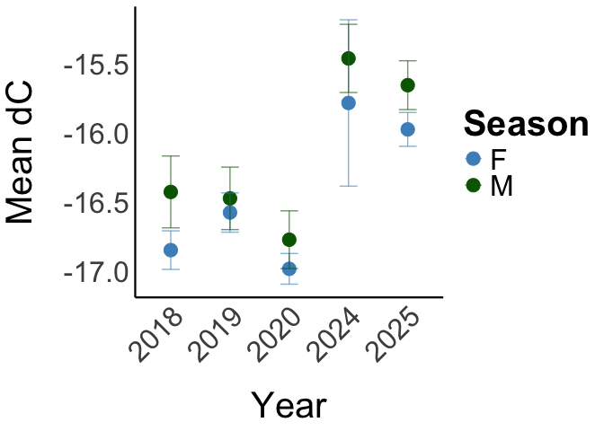

## Where were samples taken?

``` r
SIA_full$Longitude <- as.numeric(as.character(SIA_full$Longitude))
SIA_full$Location <- ifelse(SIA_full$Longitude < 122.07, "GP", "RB")

world <- ne_countries(scale = "medium", returnclass = "sf")

geo.box <- c(xmin= 110, xmax= 140, ymin= -23, ymax= -8)
sf::sf_use_s2(FALSE)
```

    Spherical geometry (s2) switched off

``` r
aus_map <- sf::read_sf("~/Documents/Murdoch/Data/Chapter 1/Additional_tracks/Final/gshhg-shp-2.3.7/GSHHS_shp/f/GSHHS_f_L1.shp") %>% st_crop(geo.box)
```

    although coordinates are longitude/latitude, st_intersection assumes that they
    are planar

    Warning: attribute variables are assumed to be spatially constant throughout
    all geometries

``` r
ggplot() +
  geom_sf(data = aus_map, fill = "grey90", color = "grey40") +
  geom_point(data = SIA_full %>% filter(!is.na(Location)), 
             aes(x = Longitude, y = Latitude, color = Location),
             size = 2) +
  coord_sf(xlim = c(121.9, 122.4),
           ylim = c(-18.3, -17.8)) +
  theme_minimal() +
  labs(x = "Longitude", y = "Latitude", color = "Location")
```

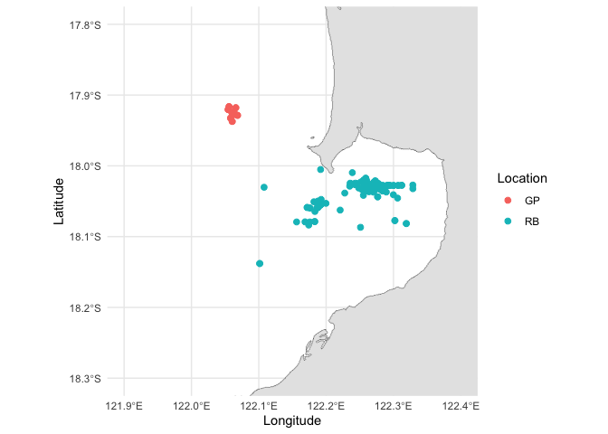

``` r
SIA_full$Location<-as.factor(SIA_full$Location)
```

## Exploring inter-annual trends in biopsy data

``` r
SIA_biopsy<-SIA_full[SIA_full$Sample_type=="Skin",]
```

## Plot for SIA

``` r
SIA_biopsy %>%
  select(C, N, Mass, Season) %>%
  ggpairs()
```

    Warning: Removed 15 rows containing missing values
    Removed 15 rows containing missing values

    Warning: Removed 15 rows containing missing values or values outside the scale range
    (`geom_point()`).
    Removed 15 rows containing missing values or values outside the scale range
    (`geom_point()`).

    Warning: Removed 15 rows containing non-finite outside the scale range
    (`stat_density()`).

    Warning: Removed 15 rows containing non-finite outside the scale range
    (`stat_boxplot()`).

    `stat_bin()` using `bins = 30`. Pick better value `binwidth`.
    `stat_bin()` using `bins = 30`. Pick better value `binwidth`.
    `stat_bin()` using `bins = 30`. Pick better value `binwidth`.

    Warning: Removed 15 rows containing non-finite outside the scale range
    (`stat_bin()`).

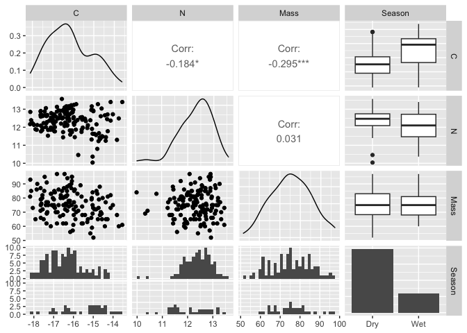

``` r
SIA_biopsy %>%
  group_by(Year, Sex) %>%
  summarise(mean_C = mean(C, na.rm = TRUE),
            se_C = sd(C, na.rm = TRUE) / sqrt(n()),
            n = n(),
            .groups = "drop") %>%
  ggplot(aes(x = Year, y = mean_C, colour = Sex, group = Sex)) +
  geom_point(size = 5) +
  geom_errorbar(aes(ymin = mean_C - se_C, ymax = mean_C + se_C), width = 0.3, alpha = 0.6)+
  scale_colour_manual(values = c("#4A90C4", "darkgreen")) +
  labs(
    x = "Year",
    y = "Mean dC",
    colour = "Sex"
  ) +
  my_theme + 
  theme(axis.text.x = element_text(angle = 45, hjust = 1))
```

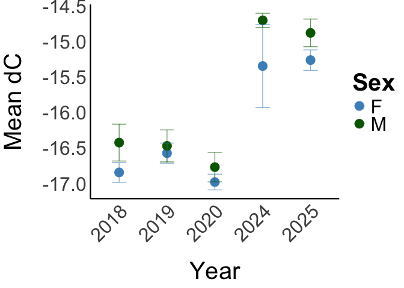

``` r
SIA_biopsy %>%
  group_by(Year, Sex) %>%
  summarise(mean_N = mean(N, na.rm = TRUE),
            se_N = sd(N, na.rm = TRUE) / sqrt(n()),
            n = n(),
            .groups = "drop") %>%
  ggplot(aes(x = Year, y = mean_N, colour = Sex, group = Sex)) +
  geom_point(size = 5) +
  geom_errorbar(aes(ymin = mean_N - se_N, ymax = mean_N + se_N), width = 0.3, alpha = 0.6)+
  scale_colour_manual(values = c("#4A90C4", "darkgreen")) +  
  labs(
    x = "Year",
    y = "Mean dN",
    colour = "Sex"
  ) +
  my_theme + 
  theme(axis.text.x = element_text(angle = 45, hjust = 1))
```

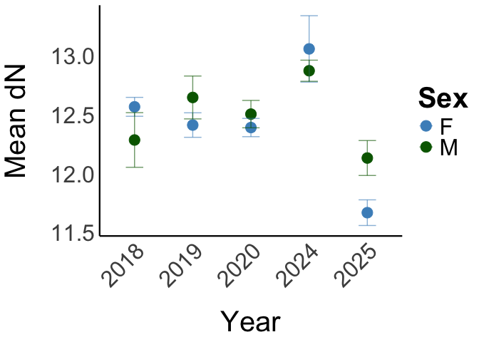

## Isoscape plots by year

``` r
SIA_biopsy %>%
  ggplot(aes(x = C, y = N, colour = Season, shape = Sex)) +
  geom_point(size = 3, alpha = 0.7) +
  facet_wrap(~Year)
```


``` r
first.plot <- ggplot(data = SIA_biopsy, 
                   mapping = aes(x = C, 
                                 y = N)) + 
  geom_point(aes(color = Year, shape = Year), size = 5) +
  ylab(expression(paste(delta^{15}, "N (\u2030)"))) +
  xlab(expression(paste(delta^{13}, "C (\u2030)"))) + 
  theme(text = element_text(size=20))

classic.first.plot <- first.plot + theme_classic() + 
  theme(text = element_text(size=35)) + 
  coord_equal() + 
  theme(axis.ticks.length = unit(-0.2, "cm")) +
  scale_colour_viridis_d(end = 0.9)
print(classic.first.plot)
```

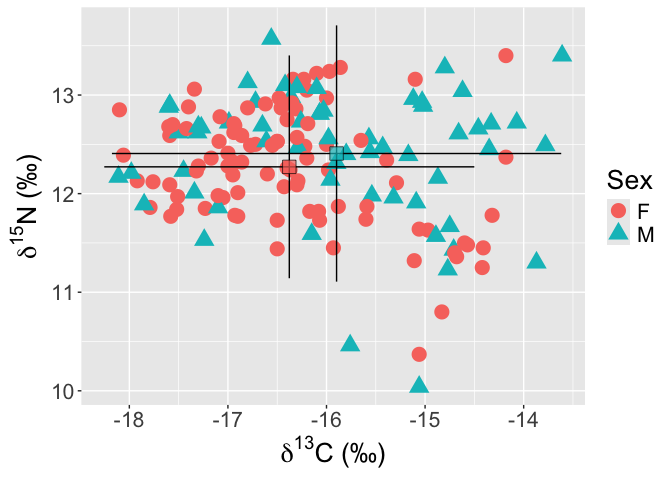

``` r
fbmeans <- SIA_biopsy %>% 
  group_by(Year) %>% 
  summarise(count = n(),
            mC = mean(C), 
            sdC = sd(C), 
            mN = mean(N), 
            sdN = sd(N) )
print(fbmeans)
```

    # A tibble: 5 × 6
      Year  count    mC   sdC    mN   sdN
      <fct> <int> <dbl> <dbl> <dbl> <dbl>
    1 2018     37 -16.7 0.849  12.4 0.675
    2 2019     26 -16.5 0.602  12.5 0.464
    3 2020     41 -16.9 0.651  12.4 0.413
    4 2024     10 -14.9 0.610  12.9 0.314
    5 2025     40 -15.1 0.750  11.9 0.598

``` r
second.plot <- first.plot + 
  geom_errorbar(data = fbmeans, 
                mapping = aes(x = mC, y = mN,
                              ymin = mN - 1.96*sdN, 
                              ymax = mN + 1.96*sdN), 
                width = 0)+
  geom_errorbarh(data = fbmeans, 
                 mapping = aes(x = mC, y = mN,
                               xmin = mC - 1.96*sdC,
                               xmax = mC + 1.96*sdC),
                 height = 0) + 
  geom_point(data = fbmeans, aes(x = mC, 
                                 y = mN,
                                 fill = Year), 
             color = "black", shape = 22, size = 5,
             alpha = 0.7, show.legend = FALSE) + 
  coord_equal()
```

    Warning: `geom_errorbarh()` was deprecated in ggplot2 4.0.0.
    ℹ Please use the `orientation` argument of `geom_errorbar()` instead.

``` r
print(second.plot)
```

    `height` was translated to `width`.

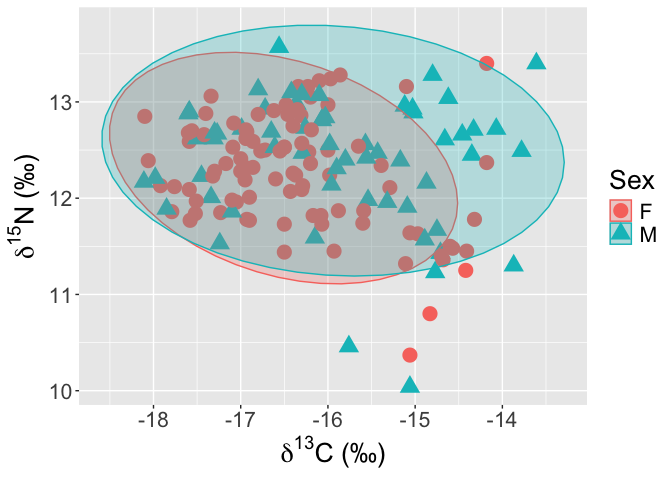

``` r
p.ell <- 0.95

ellipse.plot3 <- first.plot + 
  stat_ellipse(aes(group =Year, 
                   fill = Year, 
                   color = Year), 
               alpha = 0.25, 
               level = p.ell,
               type = "t",
               geom = "polygon")
print(ellipse.plot3)
```


## Isoscape plots by sex

``` r
first.plot <- ggplot(data = SIA_biopsy, 
                   mapping = aes(x = C, 
                                 y = N)) + 
  geom_point(aes(color = Sex, shape = Sex), size = 5) +
  ylab(expression(paste(delta^{15}, "N (\u2030)"))) +
  xlab(expression(paste(delta^{13}, "C (\u2030)"))) + 
  theme(text = element_text(size=20))

classic.first.plot <- first.plot + theme_classic() + 
  theme(text = element_text(size=35)) + 
  coord_equal() + 
  theme(axis.ticks.length = unit(-0.2, "cm")) +
  scale_colour_viridis_d(end = 0.9)
print(classic.first.plot)
```

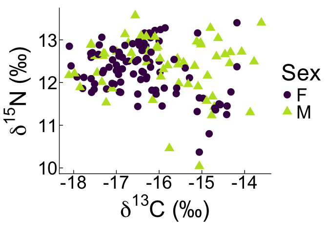

``` r
fbmeans <- SIA_biopsy %>% 
  group_by(Sex) %>% 
  summarise(count = n(),
            mC = mean(C), 
            sdC = sd(C), 
            mN = mean(N), 
            sdN = sd(N) )
print(fbmeans)
```

    # A tibble: 2 × 6
      Sex   count    mC   sdC    mN   sdN
      <chr> <int> <dbl> <dbl> <dbl> <dbl>
    1 F        94 -16.4 0.958  12.3 0.576
    2 M        60 -15.9 1.16   12.4 0.663

``` r
second.plot <- first.plot + 
  geom_errorbar(data = fbmeans, 
                mapping = aes(x = mC, y = mN,
                              ymin = mN - 1.96*sdN, 
                              ymax = mN + 1.96*sdN), 
                width = 0)+
  geom_errorbarh(data = fbmeans, 
                 mapping = aes(x = mC, y = mN,
                               xmin = mC - 1.96*sdC,
                               xmax = mC + 1.96*sdC),
                 height = 0) + 
  geom_point(data = fbmeans, aes(x = mC, 
                                 y = mN,
                                 fill = Sex), 
             color = "black", shape = 22, size = 5,
             alpha = 0.7, show.legend = FALSE) + 
  coord_equal()
print(second.plot)
```

    `height` was translated to `width`.


``` r
p.ell <- 0.95

ellipse.plot3 <- first.plot + 
  stat_ellipse(aes(group =Sex, 
                   fill = Sex, 
                   color = Sex), 
               alpha = 0.25, 
               level = p.ell,
               type = "t",
               geom = "polygon")
print(ellipse.plot3)
```


## Isoscape plots by year + sex

``` r
first.plot <- ggplot(data = SIA_biopsy, 
                   mapping = aes(x = C, 
                                 y = N)) + 
  geom_point(aes(color = Year), size = 5) +
  facet_wrap(~Sex)+
  ylab(expression(paste(delta^{15}, "N (\u2030)"))) +
  xlab(expression(paste(delta^{13}, "C (\u2030)"))) + 
  theme(text = element_text(size=20))

classic.first.plot <- first.plot + theme_classic() + 
  theme(text = element_text(size=35)) + 
  coord_equal() + 
  theme(axis.ticks.length = unit(-0.2, "cm")) +
  scale_colour_viridis_d(end = 0.9)
print(classic.first.plot)
```

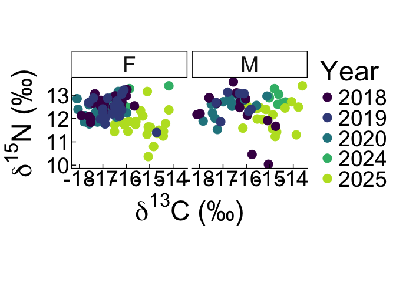

``` r
fbmeans <- SIA_biopsy %>% 
  group_by(Year, Sex) %>% 
  summarise(count = n(),
            mC = mean(C), 
            sdC = sd(C), 
            mN = mean(N), 
            sdN = sd(N) )
```

    `summarise()` has regrouped the output.
    ℹ Summaries were computed grouped by Year and Sex.
    ℹ Output is grouped by Year.
    ℹ Use `summarise(.groups = "drop_last")` to silence this message.
    ℹ Use `summarise(.by = c(Year, Sex))` for per-operation grouping
      (`?dplyr::dplyr_by`) instead.

``` r
print(fbmeans)
```

    # A tibble: 10 × 7
    # Groups:   Year [5]
       Year  Sex   count    mC   sdC    mN   sdN
       <fct> <chr> <int> <dbl> <dbl> <dbl> <dbl>
     1 2018  F        21 -16.8 0.639  12.6 0.368
     2 2018  M        16 -16.4 1.04   12.3 0.929
     3 2019  F        19 -16.6 0.618  12.4 0.454
     4 2019  M         7 -16.5 0.596  12.6 0.482
     5 2020  F        27 -17.0 0.576  12.4 0.403
     6 2020  M        14 -16.8 0.780  12.5 0.436
     7 2024  F         3 -15.3 1.01   13.1 0.489
     8 2024  M         7 -14.7 0.266  12.9 0.237
     9 2025  F        24 -15.3 0.705  11.7 0.534
    10 2025  M        16 -14.9 0.780  12.1 0.594

``` r
second.plot <- first.plot + 
  geom_errorbar(data = fbmeans, 
                mapping = aes(x = mC, y = mN,
                              ymin = mN - 1.96*sdN, 
                              ymax = mN + 1.96*sdN), 
                width = 0)+
  geom_errorbarh(data = fbmeans, 
                 mapping = aes(x = mC, y = mN,
                               xmin = mC - 1.96*sdC,
                               xmax = mC + 1.96*sdC),
                 height = 0) + 
  geom_point(data = fbmeans, aes(x = mC, 
                                 y = mN,
                                 fill = Year), 
             color = "black", shape = 22, size = 5,
             alpha = 0.7, show.legend = FALSE) + 
  coord_equal()
print(second.plot)
```

    `height` was translated to `width`.

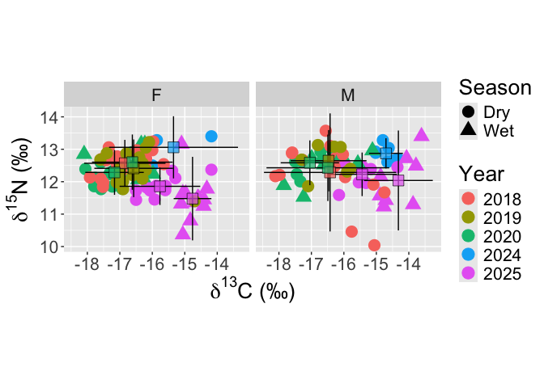

``` r
p.ell <- 0.95

ellipse.plot3 <- first.plot + 
  stat_ellipse(aes(group =Year, 
                   fill = Year, 
                   color = Year), 
               alpha = 0.25, 
               level = p.ell,
               type = "t",
               geom = "polygon")
print(ellipse.plot3)
```

    Too few points to calculate an ellipse

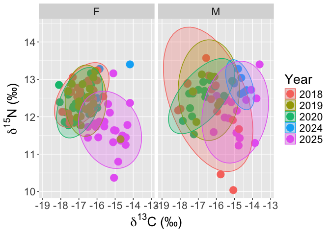

\##Try inter-annual trends again with just August/dry season data OR
include month as a covariate, especially since season was significant
for N

``` r
SIA_biopsy_dry<-SIA_biopsy[SIA_biopsy$Month=="8",]

first.plot <- ggplot(data = SIA_biopsy_dry, 
                   mapping = aes(x = C, 
                                 y = N)) + 
  geom_point(aes(color = Year), size = 5) +
  facet_wrap(~Sex)+
  ylab(expression(paste(delta^{15}, "N (\u2030)"))) +
  xlab(expression(paste(delta^{13}, "C (\u2030)"))) + 
  theme(text = element_text(size=20))

classic.first.plot <- first.plot + theme_classic() + 
  theme(text = element_text(size=35)) + 
  coord_equal() + 
  theme(axis.ticks.length = unit(-0.2, "cm")) +
  scale_colour_viridis_d(end = 0.9)
print(classic.first.plot)
```

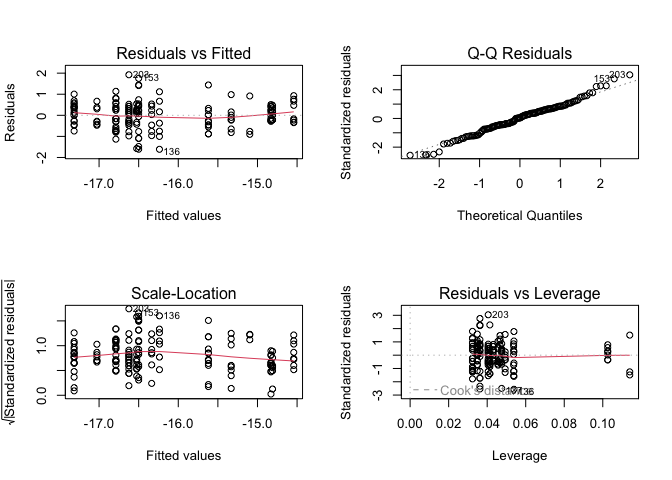

``` r
fbmeans <- SIA_biopsy_dry %>% 
  group_by(Year, Sex) %>% 
  summarise(count = n(),
            mC = mean(C), 
            sdC = sd(C), 
            mN = mean(N), 
            sdN = sd(N) )
```

    `summarise()` has regrouped the output.
    ℹ Summaries were computed grouped by Year and Sex.
    ℹ Output is grouped by Year.
    ℹ Use `summarise(.groups = "drop_last")` to silence this message.
    ℹ Use `summarise(.by = c(Year, Sex))` for per-operation grouping
      (`?dplyr::dplyr_by`) instead.

``` r
print(fbmeans)
```

    # A tibble: 10 × 7
    # Groups:   Year [5]
       Year  Sex   count    mC    sdC    mN    sdN
       <fct> <chr> <int> <dbl>  <dbl> <dbl>  <dbl>
     1 2018  F         8 -17.1  0.607  12.7  0.287
     2 2018  M        10 -16.4  1.18   12.3  0.974
     3 2019  F         6 -16.4  0.902  12.0  0.364
     4 2019  M         1 -17.1 NA      11.9 NA    
     5 2020  F        18 -17.2  0.460  12.3  0.353
     6 2020  M         7 -17.0  0.458  12.6  0.352
     7 2024  F         3 -15.3  1.01   13.1  0.489
     8 2024  M         7 -14.7  0.266  12.9  0.237
     9 2025  F        12 -15.8  0.633  11.9  0.294
    10 2025  M         8 -15.4  0.547  12.2  0.343

``` r
second.plot <- first.plot + 
  geom_errorbar(data = fbmeans, 
                mapping = aes(x = mC, y = mN,
                              ymin = mN - 1.96*sdN, 
                              ymax = mN + 1.96*sdN), 
                width = 0)+
  geom_errorbarh(data = fbmeans, 
                 mapping = aes(x = mC, y = mN,
                               xmin = mC - 1.96*sdC,
                               xmax = mC + 1.96*sdC),
                 height = 0) + 
  geom_point(data = fbmeans, aes(x = mC, 
                                 y = mN,
                                 fill = Year), 
             color = "black", shape = 22, size = 5,
             alpha = 0.7, show.legend = FALSE) + 
  coord_equal()
print(second.plot)
```

    `height` was translated to `width`.

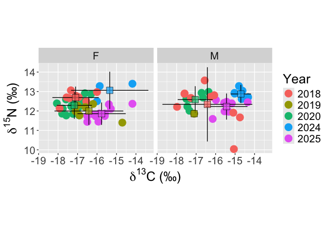

``` r
p.ell <- 0.95

ellipse.plot3 <- first.plot + 
  stat_ellipse(aes(group =Year, 
                   fill = Year, 
                   color = Year), 
               alpha = 0.25, 
               level = p.ell,
               type = "t",
               geom = "polygon")
print(ellipse.plot3)
```

    Too few points to calculate an ellipse
    Too few points to calculate an ellipse

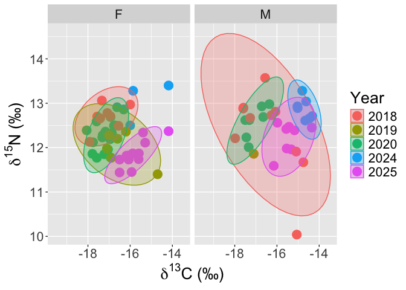

## Isoscape plots by year + sex + season

``` r
first.plot <- ggplot(data = SIA_biopsy, 
                   mapping = aes(x = C, 
                                 y = N)) + 
  geom_point(aes(color = Year, shape = Season), size = 5) +
  facet_wrap(~Sex)+
  ylab(expression(paste(delta^{15}, "N (\u2030)"))) +
  xlab(expression(paste(delta^{13}, "C (\u2030)"))) + 
  theme(text = element_text(size=20))

classic.first.plot <- first.plot + theme_classic() + 
  theme(text = element_text(size=35)) + 
  coord_equal() + 
  theme(axis.ticks.length = unit(-0.2, "cm")) +
  scale_colour_viridis_d(end = 0.9)
print(classic.first.plot)
```


``` r
fbmeans <- SIA_biopsy %>% 
  group_by(Year, Sex, Season) %>% 
  summarise(count = n(),
            mC = mean(C), 
            sdC = sd(C), 
            mN = mean(N), 
            sdN = sd(N) )
```

    `summarise()` has regrouped the output.
    ℹ Summaries were computed grouped by Year, Sex, and Season.
    ℹ Output is grouped by Year and Sex.
    ℹ Use `summarise(.groups = "drop_last")` to silence this message.
    ℹ Use `summarise(.by = c(Year, Sex, Season))` for per-operation grouping
      (`?dplyr::dplyr_by`) instead.

``` r
print(fbmeans)
```

    # A tibble: 14 × 8
    # Groups:   Year, Sex [10]
       Year  Sex   Season count    mC   sdC    mN   sdN
       <fct> <chr> <chr>  <int> <dbl> <dbl> <dbl> <dbl>
     1 2018  F     Dry       21 -16.8 0.639  12.6 0.368
     2 2018  M     Dry       16 -16.4 1.04   12.3 0.929
     3 2019  F     Dry       19 -16.6 0.618  12.4 0.454
     4 2019  M     Dry        7 -16.5 0.596  12.6 0.482
     5 2020  F     Dry       18 -17.2 0.460  12.3 0.353
     6 2020  F     Wet        9 -16.6 0.634  12.6 0.435
     7 2020  M     Dry        7 -17.0 0.458  12.6 0.352
     8 2020  M     Wet        7 -16.5 0.964  12.4 0.522
     9 2024  F     Dry        3 -15.3 1.01   13.1 0.489
    10 2024  M     Dry        7 -14.7 0.266  12.9 0.237
    11 2025  F     Dry       12 -15.8 0.633  11.9 0.294
    12 2025  F     Wet       12 -14.8 0.296  11.5 0.657
    13 2025  M     Dry        8 -15.4 0.547  12.2 0.343
    14 2025  M     Wet        8 -14.3 0.540  12.0 0.786

``` r
second.plot <- first.plot + 
  geom_errorbar(data = fbmeans, 
                mapping = aes(x = mC, y = mN,
                              ymin = mN - 1.96*sdN, 
                              ymax = mN + 1.96*sdN), 
                width = 0)+
  geom_errorbarh(data = fbmeans, 
                 mapping = aes(x = mC, y = mN,
                               xmin = mC - 1.96*sdC,
                               xmax = mC + 1.96*sdC),
                 height = 0) + 
  geom_point(data = fbmeans, aes(x = mC, 
                                 y = mN,
                                 fill = Year, shape = Season), 
             color = "black", shape = 22, size = 5,
             alpha = 0.7, show.legend = FALSE) + 
  coord_equal()
print(second.plot)
```

    `height` was translated to `width`.


``` r
p.ell <- 0.95

ellipse.plot3 <- first.plot + 
  stat_ellipse(aes(group =interaction(Year, Season), 
                   fill = Year, 
                   color = Year,
                   linetype = Season), 
               alpha = 0.25, 
               level = p.ell,
               type = "t",
               geom = "polygon")
print(ellipse.plot3)
```

    Too few points to calculate an ellipse

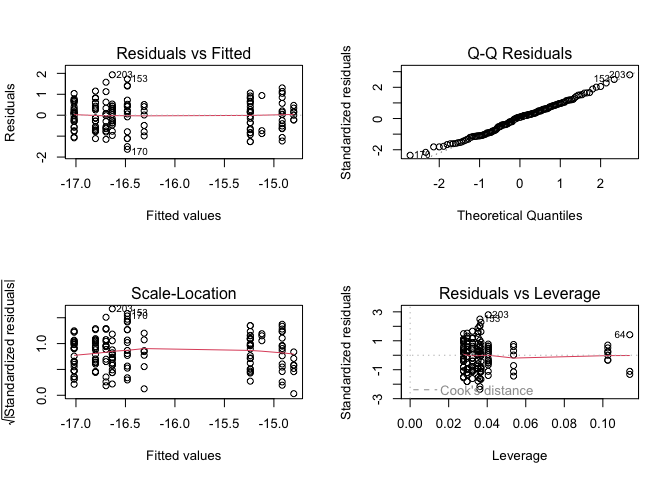

## Running models

``` r
SIA_biopsy %>% count(Year, Sex, Season)
```

       Year Sex Season  n
    1  2018   F    Dry 21
    2  2018   M    Dry 16
    3  2019   F    Dry 19
    4  2019   M    Dry  7
    5  2020   F    Dry 18
    6  2020   F    Wet  9
    7  2020   M    Dry  7
    8  2020   M    Wet  7
    9  2024   F    Dry  3
    10 2024   M    Dry  7
    11 2025   F    Dry 12
    12 2025   F    Wet 12
    13 2025   M    Dry  8
    14 2025   M    Wet  8

``` r
mC <- lm(C ~ Year + Sex + Season, data = SIA_biopsy)
summary(mC)
```


    Call:
    lm(formula = C ~ Year + Sex + Season, data = SIA_biopsy)

    Residuals:
         Min       1Q   Median       3Q      Max 
    -1.61248 -0.37543  0.02653  0.40345  1.92358 

    Coefficients:
                Estimate Std. Error  t value Pr(>|t|)    
    (Intercept) -16.7879     0.1162 -144.486  < 2e-16 ***
    Year2019      0.1643     0.1662    0.988  0.32458    
    Year2020     -0.5271     0.1576   -3.345  0.00105 ** 
    Year2024      1.6906     0.2320    7.286 1.80e-11 ***
    Year2025      1.1684     0.1644    7.106 4.79e-11 ***
    SexM          0.2876     0.1092    2.634  0.00933 ** 
    SeasonWet     0.7899     0.1455    5.427 2.31e-07 ***
    ---
    Signif. codes:  0 '***' 0.001 '**' 0.01 '*' 0.05 '.' 0.1 ' ' 1

    Residual standard error: 0.6458 on 147 degrees of freedom
    Multiple R-squared:  0.6465,    Adjusted R-squared:  0.6321 
    F-statistic: 44.81 on 6 and 147 DF,  p-value: < 2.2e-16

``` r
shapiro.test(resid(mC))
```


        Shapiro-Wilk normality test

    data:  resid(mC)
    W = 0.98838, p-value = 0.2309

``` r
par(mfrow = c(2,2))
plot(mC)
```


``` r
mN <- lm(N ~ Year + Sex + Season, data = SIA_biopsy)
summary(mN)
```


    Call:
    lm(formula = N ~ Year + Sex + Season, data = SIA_biopsy)

    Residuals:
         Min       1Q   Median       3Q      Max 
    -2.46858 -0.30632  0.01517  0.36810  1.52209 

    Coefficients:
                Estimate Std. Error t value Pr(>|t|)    
    (Intercept) 12.39775    0.09713 127.636  < 2e-16 ***
    Year2019     0.04818    0.13896   0.347 0.729286    
    Year2020     0.02794    0.13174   0.212 0.832314    
    Year2024     0.45467    0.19396   2.344 0.020410 *  
    Year2025    -0.54599    0.13746  -3.972 0.000111 ***
    SexM         0.11084    0.09126   1.214 0.226505    
    SeasonWet   -0.08469    0.12167  -0.696 0.487498    
    ---
    Signif. codes:  0 '***' 0.001 '**' 0.01 '*' 0.05 '.' 0.1 ' ' 1

    Residual standard error: 0.5399 on 147 degrees of freedom
    Multiple R-squared:  0.2551,    Adjusted R-squared:  0.2247 
    F-statistic: 8.391 on 6 and 147 DF,  p-value: 7.86e-08

``` r
shapiro.test(resid(mN))
```


        Shapiro-Wilk normality test

    data:  resid(mN)
    W = 0.94493, p-value = 9.865e-06

``` r
plot(mN)
```

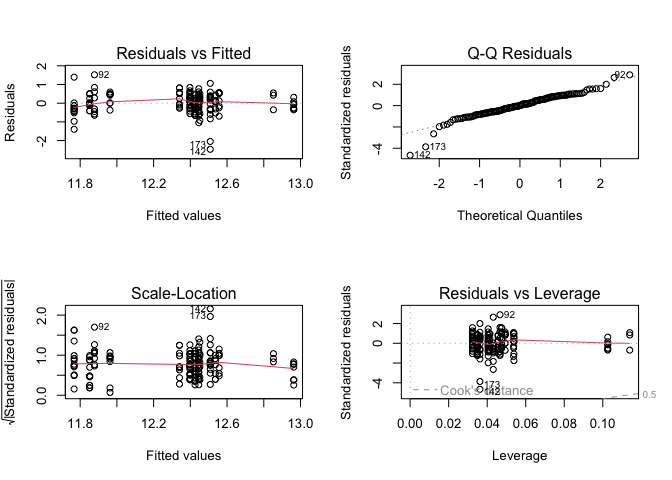

``` r
mC <- lm(C ~ Year + Sex, data = SIA_biopsy)
summary(mC)
```


    Call:
    lm(formula = C ~ Year + Sex, data = SIA_biopsy)

    Residuals:
        Min      1Q  Median      3Q     Max 
    -1.6293 -0.5570  0.0646  0.4329  1.9329 

    Coefficients:
                Estimate Std. Error  t value Pr(>|t|)    
    (Intercept) -16.8028     0.1268 -132.480  < 2e-16 ***
    Year2019      0.1699     0.1815    0.936  0.35064    
    Year2020     -0.2157     0.1603   -1.346  0.18035    
    Year2024      1.6813     0.2533    6.637 5.67e-10 ***
    Year2025      1.5645     0.1609    9.724  < 2e-16 ***
    SexM          0.3222     0.1190    2.707  0.00758 ** 
    ---
    Signif. codes:  0 '***' 0.001 '**' 0.01 '*' 0.05 '.' 0.1 ' ' 1

    Residual standard error: 0.7051 on 148 degrees of freedom
    Multiple R-squared:  0.5757,    Adjusted R-squared:  0.5614 
    F-statistic: 40.16 on 5 and 148 DF,  p-value: < 2.2e-16

``` r
shapiro.test(resid(mC))
```


        Shapiro-Wilk normality test

    data:  resid(mC)
    W = 0.99253, p-value = 0.6053

``` r
par(mfrow = c(2,2))
plot(mC)
```


``` r
mN <- lm(N ~ Year + Sex , data = SIA_biopsy)
summary(mN)
```


    Call:
    lm(formula = N ~ Year + Sex, data = SIA_biopsy)

    Residuals:
         Min       1Q   Median       3Q      Max 
    -2.46648 -0.32065  0.03547  0.36352  1.48197 

    Coefficients:
                 Estimate Std. Error t value Pr(>|t|)    
    (Intercept) 12.399349   0.096937 127.911  < 2e-16 ***
    Year2019     0.047577   0.138714   0.343   0.7321    
    Year2020    -0.005442   0.122486  -0.044   0.9646    
    Year2024     0.455660   0.193617   2.353   0.0199 *  
    Year2025    -0.588451   0.122964  -4.786 4.09e-06 ***
    SexM         0.107130   0.090946   1.178   0.2407    
    ---
    Signif. codes:  0 '***' 0.001 '**' 0.01 '*' 0.05 '.' 0.1 ' ' 1

    Residual standard error: 0.5389 on 148 degrees of freedom
    Multiple R-squared:  0.2527,    Adjusted R-squared:  0.2274 
    F-statistic: 10.01 on 5 and 148 DF,  p-value: 2.891e-08

``` r
shapiro.test(resid(mN))
```


        Shapiro-Wilk normality test

    data:  resid(mN)
    W = 0.94432, p-value = 8.809e-06

``` r
plot(mN)
```

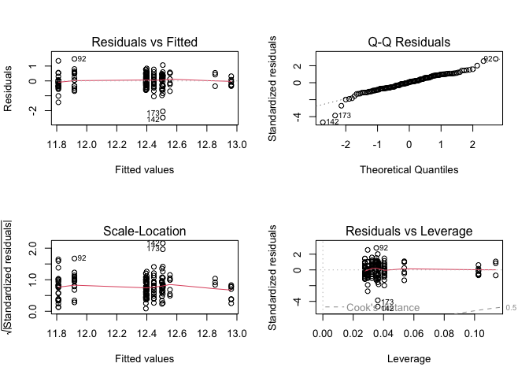

``` r
SIA_biopsy %>%
  ggplot(aes(x = C, y = Mass)) +
  geom_point(size = 5)
```

    Warning: Removed 15 rows containing missing values or values outside the scale range
    (`geom_point()`).

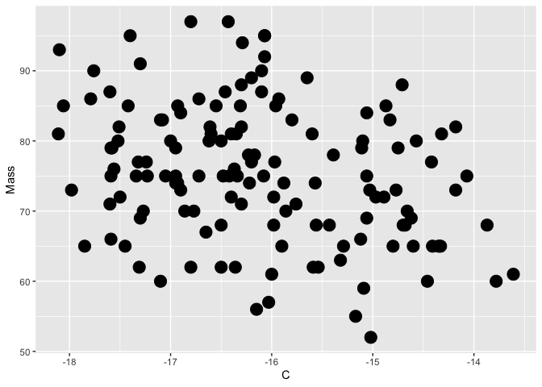

``` r
SIA_biopsy %>%
  ggplot(aes(x = N, y = Mass)) +
  geom_point(size = 5)
```

    Warning: Removed 15 rows containing missing values or values outside the scale range
    (`geom_point()`).

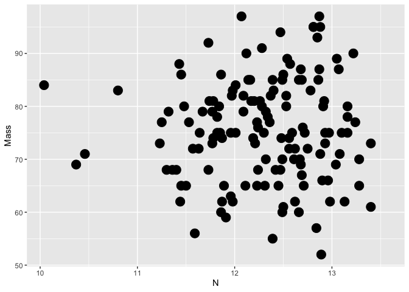

## Next on the list is repeating this for blood samples AND tissue comparison AND considering the above analysis and whether the sample is actually representative of wet/dry

\##Consider not using season since turnover time is likely longer than a
season BUT if we can validate against eDNA we may be able to infer
expected turnover time

\##Blood turnover expected 3-5 months and skin could be 3-12 months
(Seminoff et al., 2007)

## Exploring inter-annual trends in biopsy data

``` r
SIA_blood<-SIA_full[SIA_full$Sample_type=="Blood",]
```

## Plot for SIA

``` r
SIA_blood %>%
  select(C, N, Mass, Season) %>%
  ggpairs()
```

    `stat_bin()` using `bins = 30`. Pick better value `binwidth`.
    `stat_bin()` using `bins = 30`. Pick better value `binwidth`.
    `stat_bin()` using `bins = 30`. Pick better value `binwidth`.

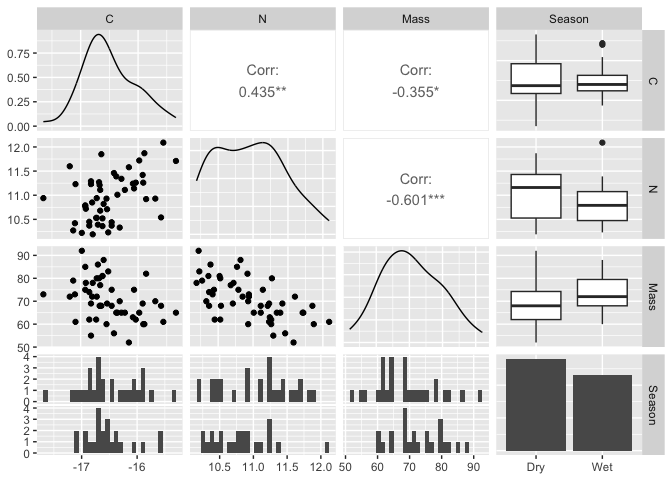

``` r
SIA_blood %>%
  group_by(Month_Year, Sex) %>%
  summarise(mean_C = mean(C, na.rm = TRUE),
            se_C = sd(C, na.rm = TRUE) / sqrt(n()),
            n = n(),
            .groups = "drop") %>%
  ggplot(aes(x = Month_Year, y = mean_C, colour = Sex, group = Sex)) +
  geom_point(size = 5) +
  geom_errorbar(aes(ymin = mean_C - se_C, ymax = mean_C + se_C), width = 0.3, alpha = 0.6)+
  scale_colour_manual(values = c("#4A90C4", "darkgreen")) +
  labs(
    x = "Month-Year",
    y = "Mean dC",
    colour = "Sex"
  ) +
  my_theme + 
  theme(axis.text.x = element_text(angle = 45, hjust = 1))
```

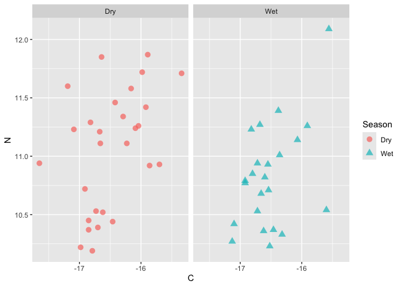

``` r
SIA_blood %>%
  group_by(Month_Year, Sex) %>%
  summarise(mean_N = mean(N, na.rm = TRUE),
            se_N = sd(N, na.rm = TRUE) / sqrt(n()),
            n = n(),
            .groups = "drop") %>%
  ggplot(aes(x = Month_Year, y = mean_N, colour = Sex, group = Sex)) +
  geom_point(size = 5) +
  geom_errorbar(aes(ymin = mean_N - se_N, ymax = mean_N + se_N), width = 0.3, alpha = 0.6)+
  scale_colour_manual(values = c("#4A90C4", "darkgreen")) +  
  labs(
    x = "Month-Year",
    y = "Mean dN",
    colour = "Sex"
  ) +
  my_theme + 
  theme(axis.text.x = element_text(angle = 45, hjust = 1))
```

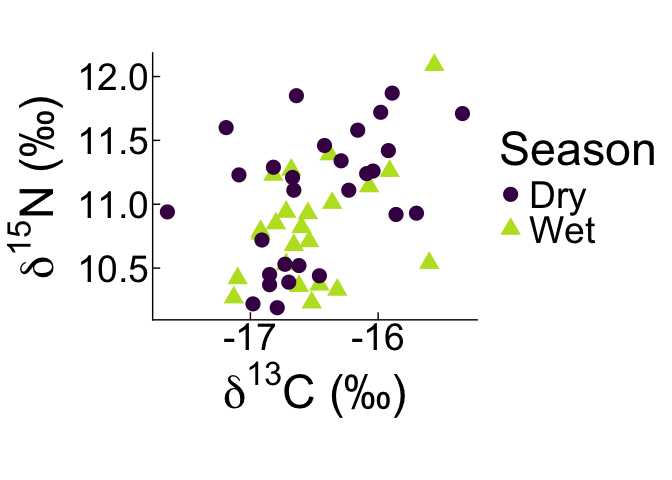

## Isoscape plots by season

``` r
SIA_blood %>%
  ggplot(aes(x = C, y = N, colour = Season, shape = Season)) +
  geom_point(size = 3, alpha = 0.7) +
  facet_wrap(~Season)
```

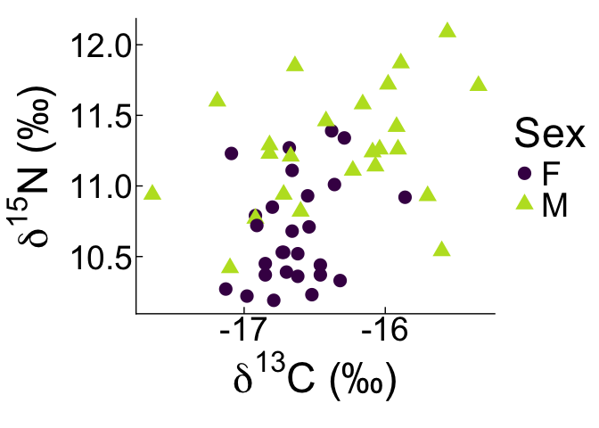

``` r
first.plot <- ggplot(data = SIA_blood, 
                   mapping = aes(x = C, 
                                 y = N)) + 
  geom_point(aes(color = Season, shape = Season), size = 5) +
  ylab(expression(paste(delta^{15}, "N (\u2030)"))) +
  xlab(expression(paste(delta^{13}, "C (\u2030)"))) + 
  theme(text = element_text(size=20))

classic.first.plot <- first.plot + theme_classic() + 
  theme(text = element_text(size=35)) + 
  coord_equal() + 
  theme(axis.ticks.length = unit(-0.2, "cm")) +
  scale_colour_viridis_d(end = 0.9)
print(classic.first.plot)
```


``` r
fbmeans <- SIA_blood %>% 
  group_by(Season) %>% 
  summarise(count = n(),
            mC = mean(C), 
            sdC = sd(C), 
            mN = mean(N), 
            sdN = sd(N) )
print(fbmeans)
```

    # A tibble: 2 × 6
      Season count    mC   sdC    mN   sdN
      <chr>  <int> <dbl> <dbl> <dbl> <dbl>
    1 Dry       28 -16.5 0.514  11.1 0.514
    2 Wet       23 -16.5 0.414  10.8 0.444

``` r
second.plot <- first.plot + 
  geom_errorbar(data = fbmeans, 
                mapping = aes(x = mC, y = mN,
                              ymin = mN - 1.96*sdN, 
                              ymax = mN + 1.96*sdN), 
                width = 0)+
  geom_errorbarh(data = fbmeans, 
                 mapping = aes(x = mC, y = mN,
                               xmin = mC - 1.96*sdC,
                               xmax = mC + 1.96*sdC),
                 height = 0) + 
  geom_point(data = fbmeans, aes(x = mC, 
                                 y = mN,
                                 fill = Season), 
             color = "black", shape = 22, size = 5,
             alpha = 0.7, show.legend = FALSE) + 
  coord_equal()
print(second.plot)
```

    `height` was translated to `width`.

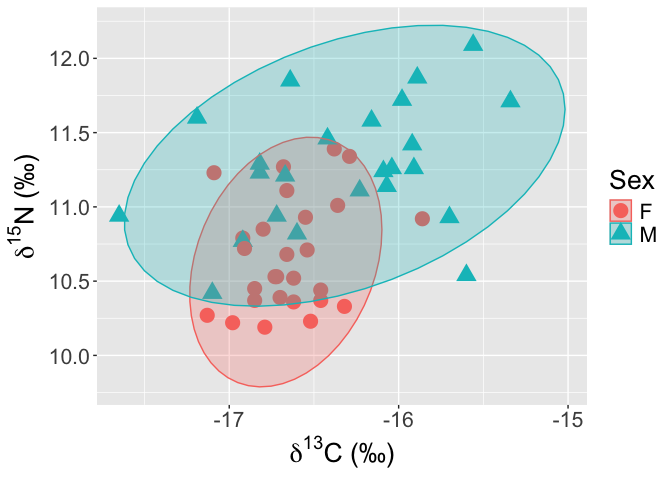

``` r
p.ell <- 0.95

ellipse.plot3 <- first.plot + 
  stat_ellipse(aes(group =Season, 
                   fill = Season, 
                   color = Season), 
               alpha = 0.25, 
               level = p.ell,
               type = "t",
               geom = "polygon")
print(ellipse.plot3)
```

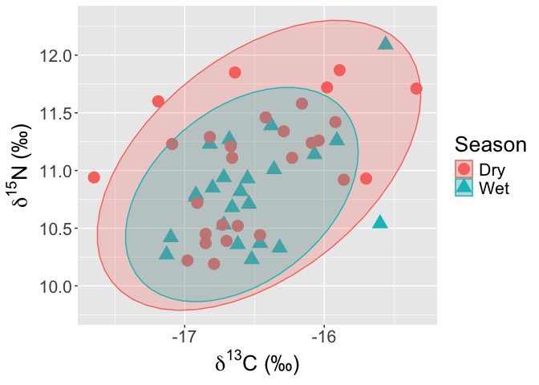

## Isoscape plots by sex

``` r
first.plot <- ggplot(data = SIA_blood, 
                   mapping = aes(x = C, 
                                 y = N)) + 
  geom_point(aes(color = Sex, shape = Sex), size = 5) +
  ylab(expression(paste(delta^{15}, "N (\u2030)"))) +
  xlab(expression(paste(delta^{13}, "C (\u2030)"))) + 
  theme(text = element_text(size=20))

classic.first.plot <- first.plot + theme_classic() + 
  theme(text = element_text(size=35)) + 
  coord_equal() + 
  theme(axis.ticks.length = unit(-0.2, "cm")) +
  scale_colour_viridis_d(end = 0.9)
print(classic.first.plot)
```


``` r
fbmeans <- SIA_blood %>% 
  group_by(Sex) %>% 
  summarise(count = n(),
            mC = mean(C), 
            sdC = sd(C), 
            mN = mean(N), 
            sdN = sd(N) )
print(fbmeans)
```

    # A tibble: 2 × 6
      Sex   count    mC   sdC    mN   sdN
      <chr> <int> <dbl> <dbl> <dbl> <dbl>
    1 F        27 -16.6 0.273  10.7 0.370
    2 M        24 -16.3 0.581  11.3 0.423

``` r
second.plot <- first.plot + 
  geom_errorbar(data = fbmeans, 
                mapping = aes(x = mC, y = mN,
                              ymin = mN - 1.96*sdN, 
                              ymax = mN + 1.96*sdN), 
                width = 0)+
  geom_errorbarh(data = fbmeans, 
                 mapping = aes(x = mC, y = mN,
                               xmin = mC - 1.96*sdC,
                               xmax = mC + 1.96*sdC),
                 height = 0) + 
  geom_point(data = fbmeans, aes(x = mC, 
                                 y = mN,
                                 fill = Sex), 
             color = "black", shape = 22, size = 5,
             alpha = 0.7, show.legend = FALSE) + 
  coord_equal()
print(second.plot)
```

    `height` was translated to `width`.

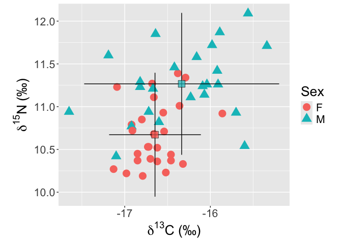

``` r
p.ell <- 0.95

ellipse.plot3 <- first.plot + 
  stat_ellipse(aes(group =Sex, 
                   fill = Sex, 
                   color = Sex), 
               alpha = 0.25, 
               level = p.ell,
               type = "t",
               geom = "polygon")
print(ellipse.plot3)
```

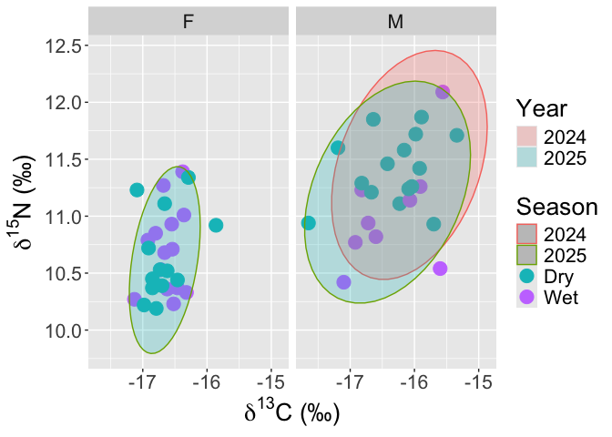

## Isoscape plots by season + sex

``` r
first.plot <- ggplot(data = SIA_blood, 
                   mapping = aes(x = C, 
                                 y = N)) + 
  geom_point(aes(color = Season), size = 5) +
  facet_wrap(~Sex)+
  ylab(expression(paste(delta^{15}, "N (\u2030)"))) +
  xlab(expression(paste(delta^{13}, "C (\u2030)"))) + 
  theme(text = element_text(size=20))

classic.first.plot <- first.plot + theme_classic() + 
  theme(text = element_text(size=35)) + 
  coord_equal() + 
  theme(axis.ticks.length = unit(-0.2, "cm")) +
  scale_colour_viridis_d(end = 0.9)
print(classic.first.plot)
```

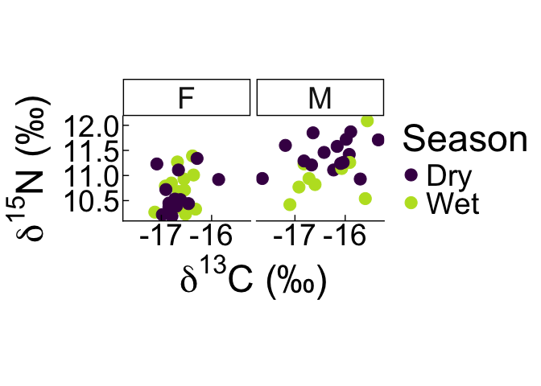

``` r
fbmeans <- SIA_blood %>% 
  group_by(Season, Sex) %>% 
  summarise(count = n(),
            mC = mean(C), 
            sdC = sd(C), 
            mN = mean(N), 
            sdN = sd(N) )
```

    `summarise()` has regrouped the output.
    ℹ Summaries were computed grouped by Season and Sex.
    ℹ Output is grouped by Season.
    ℹ Use `summarise(.groups = "drop_last")` to silence this message.
    ℹ Use `summarise(.by = c(Season, Sex))` for per-operation grouping
      (`?dplyr::dplyr_by`) instead.

``` r
print(fbmeans)
```

    # A tibble: 4 × 7
    # Groups:   Season [2]
      Season Sex   count    mC   sdC    mN   sdN
      <chr>  <chr> <int> <dbl> <dbl> <dbl> <dbl>
    1 Dry    F        13 -16.7 0.324  10.6 0.383
    2 Dry    M        15 -16.3 0.596  11.4 0.305
    3 Wet    F        14 -16.6 0.225  10.7 0.370
    4 Wet    M         9 -16.4 0.588  11.0 0.495

``` r
second.plot <- first.plot + 
  geom_errorbar(data = fbmeans, 
                mapping = aes(x = mC, y = mN,
                              ymin = mN - 1.96*sdN, 
                              ymax = mN + 1.96*sdN), 
                width = 0)+
  geom_errorbarh(data = fbmeans, 
                 mapping = aes(x = mC, y = mN,
                               xmin = mC - 1.96*sdC,
                               xmax = mC + 1.96*sdC),
                 height = 0) + 
  geom_point(data = fbmeans, aes(x = mC, 
                                 y = mN,
                                 fill = Season), 
             color = "black", shape = 22, size = 5,
             alpha = 0.7, show.legend = FALSE) + 
  coord_equal()
print(second.plot)
```

    `height` was translated to `width`.

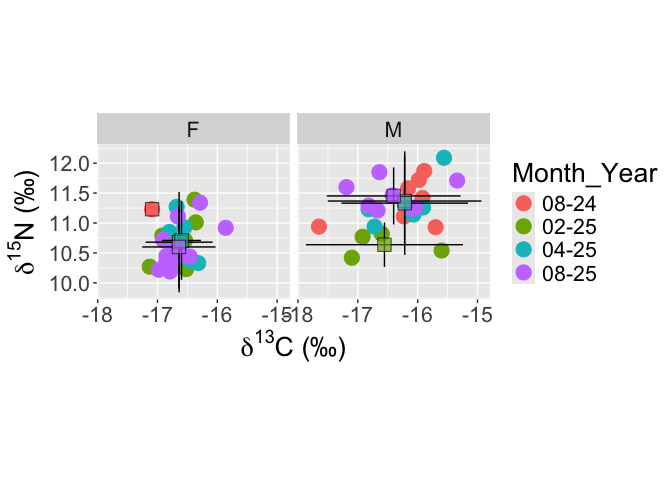

``` r
p.ell <- 0.95

ellipse.plot3 <- first.plot + 
  stat_ellipse(aes(group =Season, 
                   fill = Season, 
                   color = Season), 
               alpha = 0.25, 
               level = p.ell,
               type = "t",
               geom = "polygon")
print(ellipse.plot3)
```


## Isoscape plots by year + sex + season

``` r
first.plot <- ggplot(data = SIA_blood, 
                   mapping = aes(x = C, 
                                 y = N)) + 
  geom_point(aes(color = Month_Year), size = 5) +
  facet_wrap(~Sex)+
  ylab(expression(paste(delta^{15}, "N (\u2030)"))) +
  xlab(expression(paste(delta^{13}, "C (\u2030)"))) + 
  theme(text = element_text(size=20))

classic.first.plot <- first.plot + theme_classic() + 
  theme(text = element_text(size=35)) + 
  coord_equal() + 
  theme(axis.ticks.length = unit(-0.2, "cm")) +
  scale_colour_viridis_d(end = 0.9)
print(classic.first.plot)
```

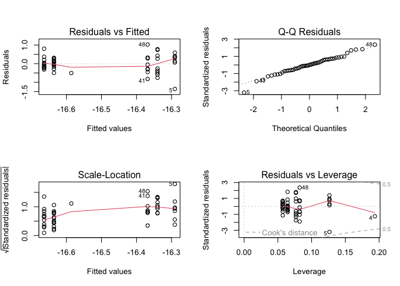

``` r
fbmeans <- SIA_blood %>% 
  group_by(Month_Year, Sex) %>% 
  summarise(count = n(),
            mC = mean(C), 
            sdC = sd(C), 
            mN = mean(N), 
            sdN = sd(N) )
```

    `summarise()` has regrouped the output.
    ℹ Summaries were computed grouped by Month_Year and Sex.
    ℹ Output is grouped by Month_Year.
    ℹ Use `summarise(.groups = "drop_last")` to silence this message.
    ℹ Use `summarise(.by = c(Month_Year, Sex))` for per-operation grouping
      (`?dplyr::dplyr_by`) instead.

``` r
print(fbmeans)
```

    # A tibble: 8 × 7
    # Groups:   Month_Year [4]
      Month_Year Sex   count    mC    sdC    mN    sdN
      <fct>      <chr> <int> <dbl>  <dbl> <dbl>  <dbl>
    1 08-24      F         1 -17.1 NA      11.2 NA    
    2 08-24      M         7 -16.2  0.655  11.4  0.380
    3 02-25      F         7 -16.6  0.286  10.7  0.428
    4 02-25      M         4 -16.6  0.669  10.6  0.189
    5 04-25      F         7 -16.6  0.166  10.7  0.335
    6 04-25      M         5 -16.2  0.539  11.3  0.442
    7 08-25      F        12 -16.6  0.313  10.6  0.356
    8 08-25      M         8 -16.4  0.571  11.5  0.243

``` r
second.plot <- first.plot + 
  geom_errorbar(data = fbmeans, 
                mapping = aes(x = mC, y = mN,
                              ymin = mN - 1.96*sdN, 
                              ymax = mN + 1.96*sdN), 
                width = 0)+
  geom_errorbarh(data = fbmeans, 
                 mapping = aes(x = mC, y = mN,
                               xmin = mC - 1.96*sdC,
                               xmax = mC + 1.96*sdC),
                 height = 0) + 
  geom_point(data = fbmeans, aes(x = mC, 
                                 y = mN,
                                 fill = Month_Year), 
             color = "black", shape = 22, size = 5,
             alpha = 0.7, show.legend = FALSE) + 
  coord_equal()
print(second.plot)
```

    `height` was translated to `width`.


``` r
p.ell <- 0.95

ellipse.plot3 <- first.plot + 
  stat_ellipse(aes(group = Month_Year, 
                   fill = Month_Year, 
                   color = Month_Year,
                   linetype = Month_Year), 
               alpha = 0.25, 
               level = p.ell,
               type = "t",
               geom = "polygon")
print(ellipse.plot3)
```

    Too few points to calculate an ellipse

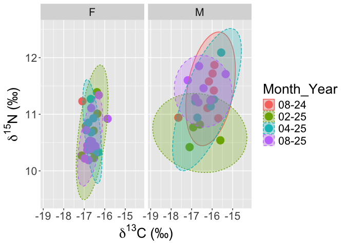

## Running models

``` r
SIA_blood %>% count(Year, Sex, Season)
```

      Year Sex Season  n
    1 2024   F    Dry  1
    2 2024   M    Dry  7
    3 2025   F    Dry 12
    4 2025   F    Wet 14
    5 2025   M    Dry  8
    6 2025   M    Wet  9

``` r
mC <- lm(C ~ Year + Sex + Season, data = SIA_blood)
summary(mC)
```


    Call:
    lm(formula = C ~ Year + Sex + Season, data = SIA_blood)

    Residuals:
         Min       1Q   Median       3Q      Max 
    -1.35945 -0.26587  0.00373  0.27691  1.02816 

    Coefficients:
                 Estimate Std. Error t value Pr(>|t|)    
    (Intercept) -16.58612    0.19960 -83.096   <2e-16 ***
    Year2025     -0.07761    0.20042  -0.387   0.7003    
    SexM          0.29556    0.13582   2.176   0.0346 *  
    SeasonWet     0.02807    0.13869   0.202   0.8405    
    ---
    Signif. codes:  0 '***' 0.001 '**' 0.01 '*' 0.05 '.' 0.1 ' ' 1

    Residual standard error: 0.4536 on 47 degrees of freedom
    Multiple R-squared:  0.1155,    Adjusted R-squared:  0.05906 
    F-statistic: 2.046 on 3 and 47 DF,  p-value: 0.1202

``` r
shapiro.test(resid(mC))
```


        Shapiro-Wilk normality test

    data:  resid(mC)
    W = 0.98279, p-value = 0.662

``` r
par(mfrow = c(2,2))
plot(mC)
```

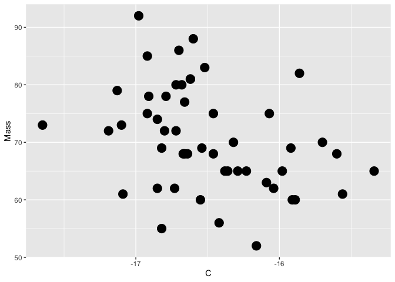

``` r
mN <- lm(N ~ Year + Sex + Season, data = SIA_blood)
summary(mN)
```


    Call:
    lm(formula = N ~ Year + Sex + Season, data = SIA_blood)

    Residuals:
         Min       1Q   Median       3Q      Max 
    -0.73129 -0.29635 -0.00529  0.27028  0.93871 

    Coefficients:
                Estimate Std. Error t value Pr(>|t|)    
    (Intercept)  10.8781     0.1730  62.882  < 2e-16 ***
    Year2025     -0.1528     0.1737  -0.880    0.383    
    SexM          0.5393     0.1177   4.581 3.41e-05 ***
    SeasonWet    -0.1133     0.1202  -0.942    0.351    
    ---
    Signif. codes:  0 '***' 0.001 '**' 0.01 '*' 0.05 '.' 0.1 ' ' 1

    Residual standard error: 0.3931 on 47 degrees of freedom
    Multiple R-squared:  0.4026,    Adjusted R-squared:  0.3645 
    F-statistic: 10.56 on 3 and 47 DF,  p-value: 2.003e-05

``` r
shapiro.test(resid(mN))
```


        Shapiro-Wilk normality test

    data:  resid(mN)
    W = 0.97968, p-value = 0.5254

``` r
plot(mN)
```

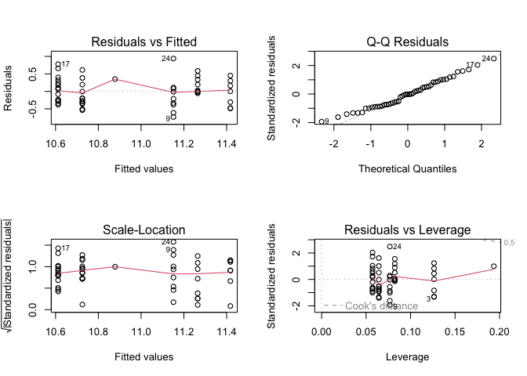

``` r
SIA_blood %>%
  ggplot(aes(x = C, y = Mass)) +
  geom_point(size = 5)
```

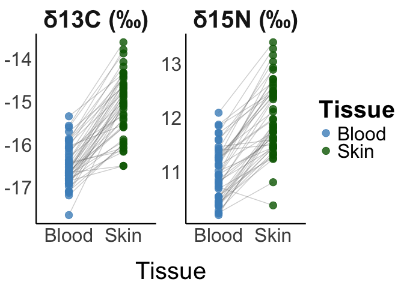

``` r
SIA_blood %>%
  ggplot(aes(x = N, y = Mass)) +
  geom_point(size = 5)
```


``` r
summary(lm(C ~ Mass + Season, data = SIA_blood))
```


    Call:
    lm(formula = C ~ Mass + Season, data = SIA_blood)

    Residuals:
         Min       1Q   Median       3Q      Max 
    -1.08730 -0.26023 -0.03181  0.20110  1.07052 

    Coefficients:
                  Estimate Std. Error t value Pr(>|t|)    
    (Intercept) -15.174000   0.503236 -30.153   <2e-16 ***
    Mass         -0.019023   0.007209  -2.639   0.0112 *  
    SeasonWet     0.039396   0.128691   0.306   0.7608    
    ---
    Signif. codes:  0 '***' 0.001 '**' 0.01 '*' 0.05 '.' 0.1 ' ' 1

    Residual standard error: 0.4456 on 48 degrees of freedom
    Multiple R-squared:  0.1281,    Adjusted R-squared:  0.09172 
    F-statistic: 3.525 on 2 and 48 DF,  p-value: 0.0373

``` r
summary(lm(N ~ Mass +  Season, data = SIA_blood))
```


    Call:
    lm(formula = N ~ Mass + Season, data = SIA_blood)

    Residuals:
         Min       1Q   Median       3Q      Max 
    -0.82395 -0.21998 -0.01082  0.28269  0.89232 

    Coefficients:
                 Estimate Std. Error t value Pr(>|t|)    
    (Intercept) 13.238052   0.450157  29.408  < 2e-16 ***
    Mass        -0.031679   0.006449  -4.912 1.09e-05 ***
    SeasonWet   -0.107950   0.115117  -0.938    0.353    
    ---
    Signif. codes:  0 '***' 0.001 '**' 0.01 '*' 0.05 '.' 0.1 ' ' 1

    Residual standard error: 0.3986 on 48 degrees of freedom
    Multiple R-squared:  0.3727,    Adjusted R-squared:  0.3465 
    F-statistic: 14.26 on 2 and 48 DF,  p-value: 1.381e-05

``` r
#Significant effect of mass for nitrogen, both significant when you take out sex

SIA_blood %>%
  ggplot(aes(x = C, y = Adipose_perc)) +
  geom_point(size = 5)
```

    Warning: Removed 25 rows containing missing values or values outside the scale range
    (`geom_point()`).

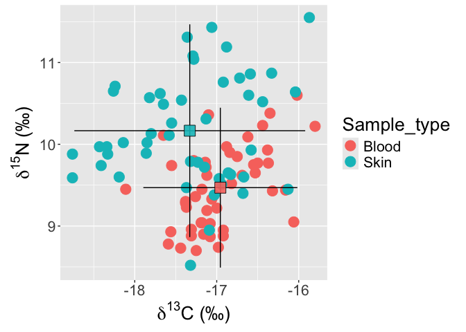

``` r
SIA_blood %>%
  ggplot(aes(x = N, y = Adipose_perc)) +
  geom_point(size = 5)
```

    Warning: Removed 25 rows containing missing values or values outside the scale range
    (`geom_point()`).

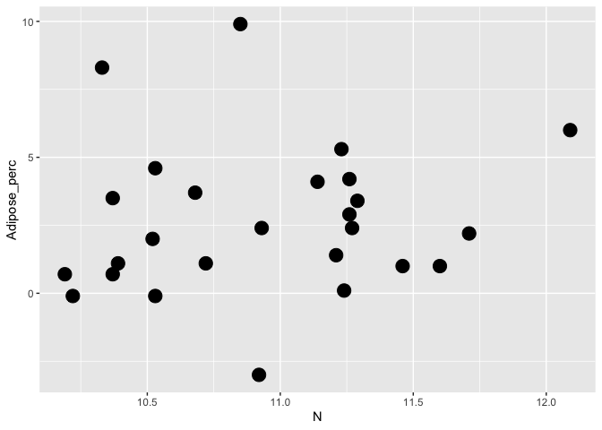

``` r
summary(lm(C ~ Adipose_perc + Sex, data = SIA_blood))
```


    Call:
    lm(formula = C ~ Adipose_perc + Sex, data = SIA_blood)

    Residuals:
         Min       1Q   Median       3Q      Max 
    -0.90980 -0.20832 -0.04261  0.19446  0.93133 

    Coefficients:
                   Estimate Std. Error  t value Pr(>|t|)    
    (Intercept)  -16.660318   0.136521 -122.035   <2e-16 ***
    Adipose_perc   0.007386   0.031685    0.233   0.8177    
    SexM           0.372736   0.172088    2.166   0.0409 *  
    ---
    Signif. codes:  0 '***' 0.001 '**' 0.01 '*' 0.05 '.' 0.1 ' ' 1

    Residual standard error: 0.4324 on 23 degrees of freedom
      (25 observations deleted due to missingness)
    Multiple R-squared:  0.174, Adjusted R-squared:  0.1021 
    F-statistic: 2.422 on 2 and 23 DF,  p-value: 0.111

``` r
summary(lm(N ~ Adipose_perc +  Sex, data = SIA_blood))
```


    Call:
    lm(formula = N ~ Adipose_perc + Sex, data = SIA_blood)

    Residuals:
        Min      1Q  Median      3Q     Max 
    -0.3805 -0.1965 -0.1011  0.1781  0.6828 

    Coefficients:
                  Estimate Std. Error t value Pr(>|t|)    
    (Intercept)  10.563578   0.095392 110.739  < 2e-16 ***
    Adipose_perc  0.009847   0.022139   0.445    0.661    
    SexM          0.816314   0.120243   6.789 6.35e-07 ***
    ---
    Signif. codes:  0 '***' 0.001 '**' 0.01 '*' 0.05 '.' 0.1 ' ' 1

    Residual standard error: 0.3021 on 23 degrees of freedom
      (25 observations deleted due to missingness)
    Multiple R-squared:  0.6713,    Adjusted R-squared:  0.6427 
    F-statistic: 23.48 on 2 and 23 DF,  p-value: 2.776e-06

## Can also try with reproductive state, once validated and tidied up

\##Tissue comparison for those with both biopsy and bloods

``` r
paired_ids <- SIA_full %>%
  group_by(Turtle_ID) %>%
  summarise(has_skin = any(Sample_type == "Skin"),
            has_blood = any(Sample_type == "Blood")) %>%
  filter(has_skin & has_blood) %>%
  pull(Turtle_ID)

SIA_both <- SIA_full %>%
  filter(Turtle_ID %in% paired_ids)

n_distinct(SIA_both$Turtle_ID)
```

    [1] 48

``` r
head(SIA_both)
```

      Lead Sample_type Sample_name     N      C N_wt C_wt C_N_wt Sex Life_stage
    1   RB       Blood       RBC1a 11.11 -16.23 13.4 48.7    3.6   M      Adult
    2   RB       Blood       RBC3b 11.58 -16.16 14.2 48.6    3.4   M      Adult
    3   RB       Blood       RBC4a 10.93 -15.70 13.8 47.7    3.5   M      Adult
    4   RB       Blood       RBC5a 11.23 -17.09 14.0 48.3    3.4   F      Adult
    5   RB       Blood       RBC7a 10.94 -17.65 13.9 48.3    3.5   M      Adult
    6   RB       Blood       RBC8a 11.87 -15.89 14.2 48.6    3.4   M      Adult
            Date Mass Adipose_perc Turtle_ID  Latitude Longitude Month Season Year
    1 2024-08-12   65           NA       200 -18.08158  122.3191     8    Dry 2024
    2 2024-08-15   52           NA       202 -18.03219  122.2729     8    Dry 2024
    3 2024-08-16   70           NA       203 -18.03065  122.2596     8    Dry 2024
    4 2024-08-17   61           NA       204 -18.03342  122.2664     8    Dry 2024
    5 2024-08-17   73           NA       206 -18.02508  122.2578     8    Dry 2024
    6 2024-08-18   60           NA       207 -18.02990  122.2822     8    Dry 2024
      Month_Year Location
    1      08-24       RB
    2      08-24       RB
    3      08-24       RB
    4      08-24       RB
    5      08-24       RB
    6      08-24       RB

``` r
#TDFS

discrim <- tribble(
  ~Sample_type, ~Isotope, ~TDF, ~TDF_sd,
  "Blood", "C", 0.46, 0.35,
  "Blood", "N", 1.49, 0.76,
  "Skin",  "C", 2.26, 0.61,
  "Skin",  "N", 1.85, 0.50
)

SIA_both_corrected <- SIA_both %>%
  left_join(discrim %>% filter(Isotope == "C") %>% select(Sample_type, TDF_C = TDF), by = "Sample_type") %>%
  left_join(discrim %>% filter(Isotope == "N") %>% select(Sample_type, TDF_N = TDF), by = "Sample_type") %>%
  mutate(C_diet = C - TDF_C,
         N_diet = N - TDF_N)

SIA_both_long <- SIA_both_corrected %>%
  select(Turtle_ID, Sample_type, C, N) %>%
  pivot_longer(cols = c(C, N), names_to = "Isotope", values_to = "Value") %>%
  mutate(Sample_type = factor(Sample_type, levels = c("Blood", "Skin")))

ggplot(SIA_both_long, aes(x = Sample_type, y = Value, group = Turtle_ID)) +
  geom_line(alpha = 0.3, colour = "grey40") +
  geom_point(aes(colour = Sample_type), size = 4, alpha = 0.8) +
  facet_wrap(~Isotope, scales = "free_y", 
             labeller = as_labeller(c(C = "δ13C (‰)", N = "δ15N (‰)"))) +
  scale_colour_manual(values = c("#4A90C4", "darkgreen")) +
  labs(x = "Tissue", y = NULL, colour = "Tissue") +
  my_theme
```


``` r
#48 individuals with both biopsy and bloods

first.plot <- ggplot(data = SIA_both_corrected, 
                   mapping = aes(x = C_diet, y = N_diet)) + 
  geom_point(aes(color = Sample_type), size = 5) +
  ylab(expression(paste(delta^{15}, "N (\u2030)"))) +
  xlab(expression(paste(delta^{13}, "C (\u2030)"))) + 
  theme(text = element_text(size = 20))

classic.first.plot <- first.plot + theme_classic() + 
  theme(text = element_text(size = 35)) + 
  coord_equal() + 
  theme(axis.ticks.length = unit(-0.2, "cm")) +
  scale_colour_manual(values = c("#4A90C4", "darkgreen"))
print(classic.first.plot)
```

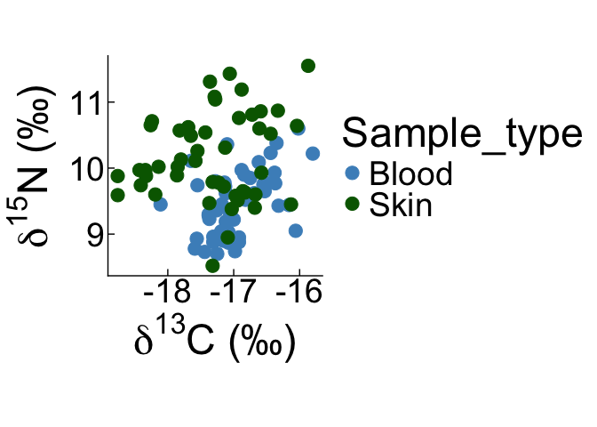

``` r
fbmeans <- SIA_both_corrected %>% 
  group_by(Sample_type) %>% 
  summarise(count = n(),
            mC = mean(C_diet), sdC = sd(C_diet), 
            mN = mean(N_diet), sdN = sd(N_diet))
print(fbmeans)
```

    # A tibble: 2 × 6
      Sample_type count    mC   sdC    mN   sdN
      <chr>       <int> <dbl> <dbl> <dbl> <dbl>
    1 Blood          48 -17.0 0.479  9.47 0.499
    2 Skin           48 -17.3 0.718 10.2  0.664

``` r
second.plot <- first.plot + 
  geom_errorbar(data = fbmeans, 
                mapping = aes(x = mC, y = mN,
                              ymin = mN - 1.96*sdN, 
                              ymax = mN + 1.96*sdN), 
                width = 0) +
  geom_errorbarh(data = fbmeans, 
                 mapping = aes(x = mC, y = mN,
                               xmin = mC - 1.96*sdC,
                               xmax = mC + 1.96*sdC),
                 height = 0) + 
  geom_point(data = fbmeans, aes(x = mC, y = mN, fill = Sample_type), 
             color = "black", shape = 22, size = 6,
             alpha = 0.9, show.legend = FALSE) + 
  coord_equal()
print(second.plot)
```

    `height` was translated to `width`.


``` r
ellipse.plot3 <- first.plot + 
  stat_ellipse(aes(group = Sample_type, 
                   fill = Sample_type, 
                   color = Sample_type), 
               alpha = 0.25, 
               level = p.ell,
               type = "t",
               geom = "polygon") +
  coord_equal()
print(ellipse.plot3)
```

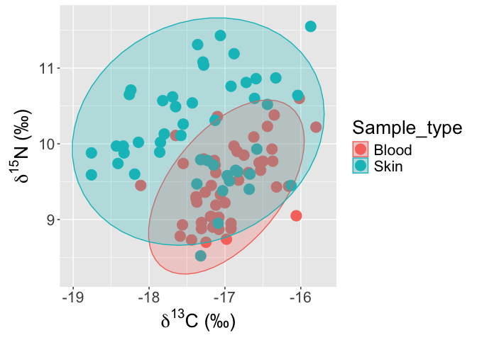

\##Within-individual differences??

``` r
individual_shift <- SIA_both_corrected %>%
  select(Turtle_ID, Sample_type, C_diet, N_diet) %>%
  pivot_wider(names_from = Sample_type, values_from = c(C_diet, N_diet)) %>%
  mutate(
    C_shift = C_diet_Skin - C_diet_Blood,   # positive = long-term diet more 13C-enriched than recent
    N_shift = N_diet_Skin - N_diet_Blood    # positive = long-term diet higher trophic level than recent
  )

individual_shift %>%
  ggplot(aes(x = C_shift)) +
  geom_histogram(bins = 15, fill = "#4A90C4", colour = "white") +
  geom_vline(xintercept = 0, linetype = "dashed", colour = "grey30") +
  labs(x = "Skin − Blood δ13C shift (diet-corrected, ‰)", y = "Number of individuals") +
  my_theme
```

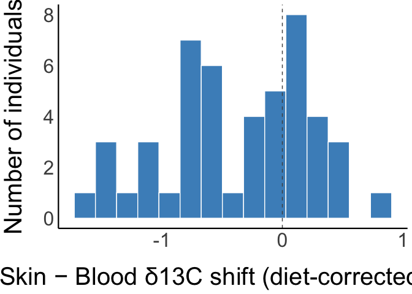

``` r
shift_model <- lm(C_shift ~ Sex + Year, data = individual_shift %>% left_join(SIA_both_corrected %>% distinct(Turtle_ID, Sex, Year), by = "Turtle_ID"))
summary(shift_model)
```


    Call:
    lm(formula = C_shift ~ Sex + Year, data = individual_shift %>% 
        left_join(SIA_both_corrected %>% distinct(Turtle_ID, Sex, 
            Year), by = "Turtle_ID"))

    Residuals:
        Min      1Q  Median      3Q     Max 
    -1.2229 -0.3875  0.1286  0.4575  1.1423 

    Coefficients:
                Estimate Std. Error t value Pr(>|t|)
    (Intercept)  -0.4438     0.2730  -1.626    0.111
    SexM          0.1215     0.1895   0.641    0.525
    Year2025      0.0152     0.2540   0.060    0.953

    Residual standard error: 0.6133 on 45 degrees of freedom
    Multiple R-squared:  0.009749,  Adjusted R-squared:  -0.03426 
    F-statistic: 0.2215 on 2 and 45 DF,  p-value: 0.8022

\##Do we have any individuals with repeat bloods?

``` r
#requires DBCA data from export
```

\##Explore influence of rainfall or SST

## Explore spatial differences in isotopes. Looks like there is signal.

\#Interestingly looking at satellite tracks individuals appear to go to
entrance point first after breeding, and by march/april end up back in
the bay

``` r
first.plot <- ggplot(data = SIA_blood %>% filter(!is.na(Location)), 
                   mapping = aes(x = C, 
                                 y = N)) + 
  geom_point(aes(color = Location), size = 5) +
  facet_wrap(~Sex)+
  ylab(expression(paste(delta^{15}, "N (\u2030)"))) +
  xlab(expression(paste(delta^{13}, "C (\u2030)"))) + 
  theme(text = element_text(size=20))


classic.first.plot <- first.plot + theme_classic() + 
  theme(text = element_text(size=35)) + 
  coord_equal() + 
  theme(axis.ticks.length = unit(-0.2, "cm")) +
  scale_colour_viridis_d(end = 0.9)
print(classic.first.plot)
```

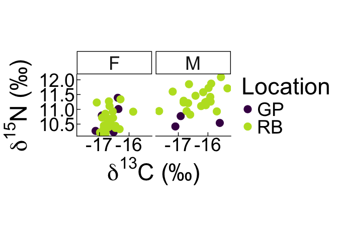

``` r
fbmeans <- SIA_blood %>% 
  group_by(Location, Sex) %>% 
  summarise(count = n(),
            mC = mean(C), 
            sdC = sd(C), 
            mN = mean(N), 
            sdN = sd(N) )
```

    `summarise()` has regrouped the output.
    ℹ Summaries were computed grouped by Location and Sex.
    ℹ Output is grouped by Location.
    ℹ Use `summarise(.groups = "drop_last")` to silence this message.
    ℹ Use `summarise(.by = c(Location, Sex))` for per-operation grouping
      (`?dplyr::dplyr_by`) instead.

``` r
print(fbmeans)
```

    # A tibble: 4 × 7
    # Groups:   Location [2]
      Location Sex   count    mC   sdC    mN   sdN
      <fct>    <chr> <int> <dbl> <dbl> <dbl> <dbl>
    1 GP       F         6 -16.7 0.309  10.7 0.469
    2 GP       M         3 -16.5 0.819  10.6 0.178
    3 RB       F        21 -16.6 0.271  10.7 0.350
    4 RB       M        21 -16.3 0.560  11.4 0.348

``` r
second.plot <- first.plot + 
  geom_errorbar(data = fbmeans, 
                mapping = aes(x = mC, y = mN,
                              ymin = mN - 1.96*sdN, 
                              ymax = mN + 1.96*sdN), 
                width = 0)+
  geom_errorbarh(data = fbmeans, 
                 mapping = aes(x = mC, y = mN,
                               xmin = mC - 1.96*sdC,
                               xmax = mC + 1.96*sdC),
                 height = 0) + 
  geom_point(data = fbmeans, aes(x = mC, 
                                 y = mN,
                                 fill = Location), 
             color = "black", shape = 22, size = 5,
             alpha = 0.7, show.legend = FALSE) + 
  coord_equal()
print(second.plot)
```

    `height` was translated to `width`.

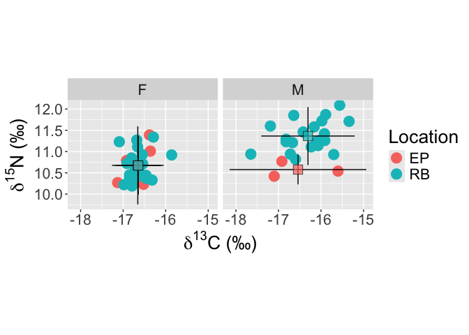

``` r
p.ell <- 0.95

ellipse.plot3 <- first.plot + 
  stat_ellipse(aes(group =Location, 
                   fill = Location, 
                   color = Location), 
               alpha = 0.25, 
               level = p.ell,
               type = "t",
               geom = "polygon")
print(ellipse.plot3)
```

    Too few points to calculate an ellipse

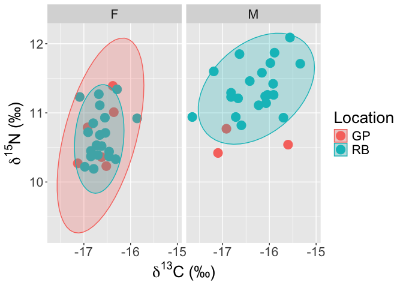

``` r
summary(lm(C ~ Location + Sex + Season, data = SIA_blood))
```


    Call:
    lm(formula = C ~ Location + Sex + Season, data = SIA_blood)

    Residuals:
         Min       1Q   Median       3Q      Max 
    -1.30935 -0.28082 -0.01229  0.28505  1.00065 

    Coefficients:
                 Estimate Std. Error t value Pr(>|t|)    
    (Intercept) -16.77728    0.21868 -76.719   <2e-16 ***
    LocationRB    0.12957    0.19357   0.669   0.5066    
    SexM          0.30706    0.12844   2.391   0.0209 *  
    SeasonWet     0.05826    0.14864   0.392   0.6969    
    ---
    Signif. codes:  0 '***' 0.001 '**' 0.01 '*' 0.05 '.' 0.1 ' ' 1

    Residual standard error: 0.4522 on 47 degrees of freedom
    Multiple R-squared:  0.1211,    Adjusted R-squared:  0.06498 
    F-statistic: 2.158 on 3 and 47 DF,  p-value: 0.1055

``` r
first.plot <- ggplot(data = SIA_biopsy %>% filter(!is.na(Location)), 
                   mapping = aes(x = C, 
                                 y = N)) + 
  geom_point(aes(color = Location), size = 5) +
  facet_wrap(~Sex)+
  ylab(expression(paste(delta^{15}, "N (\u2030)"))) +
  xlab(expression(paste(delta^{13}, "C (\u2030)"))) + 
  theme(text = element_text(size=20))

classic.first.plot <- first.plot + theme_classic() + 
  theme(text = element_text(size=35)) + 
  coord_equal() + 
  theme(axis.ticks.length = unit(-0.2, "cm")) +
  scale_colour_viridis_d(end = 0.9)
print(classic.first.plot)
```

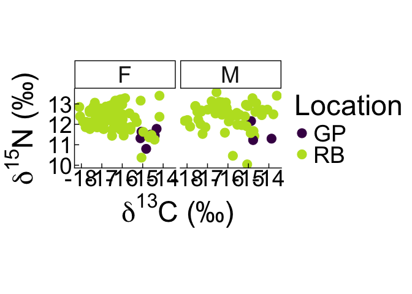

``` r
fbmeans <- SIA_biopsy %>% 
  group_by(Location, Sex) %>% 
  summarise(count = n(),
            mC = mean(C), 
            sdC = sd(C), 
            mN = mean(N), 
            sdN = sd(N) )
```

    `summarise()` has regrouped the output.
    ℹ Summaries were computed grouped by Location and Sex.
    ℹ Output is grouped by Location.
    ℹ Use `summarise(.groups = "drop_last")` to silence this message.
    ℹ Use `summarise(.by = c(Location, Sex))` for per-operation grouping
      (`?dplyr::dplyr_by`) instead.

``` r
print(fbmeans)
```

    # A tibble: 5 × 7
    # Groups:   Location [3]
      Location Sex   count    mC   sdC    mN   sdN
      <fct>    <chr> <int> <dbl> <dbl> <dbl> <dbl>
    1 GP       F         6 -14.7 0.332  11.4 0.340
    2 GP       M         3 -14.5 0.551  11.6 0.518
    3 RB       F        88 -16.5 0.879  12.3 0.543
    4 RB       M        55 -15.9 1.15   12.4 0.652
    5 <NA>     M         2 -16.6 0.877  12.8 0.120

``` r
second.plot <- first.plot + 
  geom_errorbar(data = fbmeans, 
                mapping = aes(x = mC, y = mN,
                              ymin = mN - 1.96*sdN, 
                              ymax = mN + 1.96*sdN), 
                width = 0)+
  geom_errorbarh(data = fbmeans, 
                 mapping = aes(x = mC, y = mN,
                               xmin = mC - 1.96*sdC,
                               xmax = mC + 1.96*sdC),
                 height = 0) + 
  geom_point(data = fbmeans, aes(x = mC, 
                                 y = mN,
                                 fill = Location), 
             color = "black", shape = 22, size = 5,
             alpha = 0.7, show.legend = FALSE) + 
  coord_equal()
print(second.plot)
```

    `height` was translated to `width`.

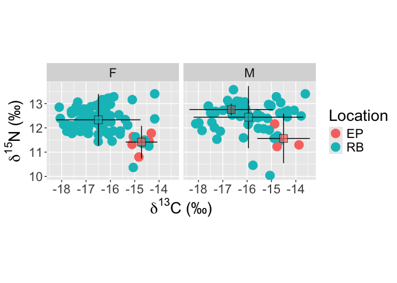

``` r
p.ell <- 0.95

ellipse.plot3 <- first.plot + 
  stat_ellipse(aes(group =Location, 
                   fill = Location, 
                   color = Location), 
               alpha = 0.25, 
               level = p.ell,
               type = "t",
               geom = "polygon")
print(ellipse.plot3)
```

    Too few points to calculate an ellipse

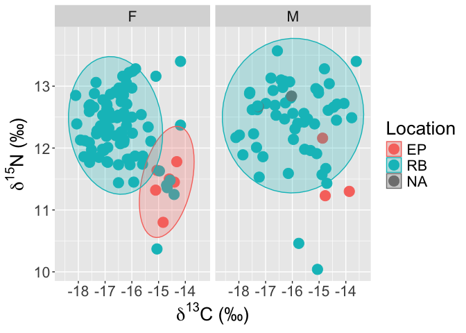

``` r
summary(lm(C ~ Location, data = SIA_biopsy))
```


    Call:
    lm(formula = C ~ Location, data = SIA_biopsy)

    Residuals:
         Min       1Q   Median       3Q      Max 
    -1.82888 -0.67888 -0.08388  0.54862  2.67112 

    Coefficients:
                Estimate Std. Error t value Pr(>|t|)    
    (Intercept) -14.6489     0.3330 -43.993  < 2e-16 ***
    LocationRB   -1.6322     0.3433  -4.754 4.63e-06 ***
    ---
    Signif. codes:  0 '***' 0.001 '**' 0.01 '*' 0.05 '.' 0.1 ' ' 1

    Residual standard error: 0.999 on 150 degrees of freedom
      (2 observations deleted due to missingness)
    Multiple R-squared:  0.131, Adjusted R-squared:  0.1252 
    F-statistic: 22.61 on 1 and 150 DF,  p-value: 4.626e-06

``` r
summary(lm(C ~ Location + Season + Sex, data = SIA_biopsy))
```


    Call:
    lm(formula = C ~ Location + Season + Sex, data = SIA_biopsy)

    Residuals:
         Min       1Q   Median       3Q      Max 
    -2.39120 -0.56018 -0.01994  0.57471  2.41245 

    Coefficients:
                Estimate Std. Error t value Pr(>|t|)    
    (Intercept) -15.4513     0.3746 -41.242  < 2e-16 ***
    LocationRB   -1.1411     0.3625  -3.148  0.00199 ** 
    SeasonWet     0.6368     0.2013   3.163  0.00189 ** 
    SexM          0.4968     0.1574   3.157  0.00193 ** 
    ---
    Signif. codes:  0 '***' 0.001 '**' 0.01 '*' 0.05 '.' 0.1 ' ' 1

    Residual standard error: 0.9406 on 148 degrees of freedom
      (2 observations deleted due to missingness)
    Multiple R-squared:  0.2398,    Adjusted R-squared:  0.2244 
    F-statistic: 15.56 on 3 and 148 DF,  p-value: 7.503e-09

\##Sample size tables for different analyses

``` r
sample_table <- SIA_biopsy %>%
  count(Sex, Year, Season)

wide_data <- sample_table %>%
  unite("Year_Season", Year, Season, sep = "_") %>%
  pivot_wider(names_from = Year_Season, values_from = n, values_fill = 0)

col_years <- sample_table %>% 
  distinct(Year, Season) %>% 
  arrange(Year, Season) %>%
  unite("Year_Season", Year, Season, sep = "_", remove = FALSE)

wide_data <- wide_data %>%
  select(Sex, all_of(col_years$Year_Season))

gt_table <- wide_data %>%
  gt(rowname_col = "Sex")

gt_table <- wide_data %>%
  gt(rowname_col = "Sex") %>%
  cols_label(.list = setNames(
    as.list(sub("^[0-9]+_", "", col_years$Year_Season)), 
    col_years$Year_Season
  ))

# add a spanner per year
for (yr in unique(col_years$Year)) {
  yr_cols <- col_years$Year_Season[col_years$Year == yr]
  gt_table <- gt_table %>%
    tab_spanner(label = yr, columns = all_of(yr_cols))
}


gt_table
```

<div id="wkldeeeuuj" style="padding-left:0px;padding-right:0px;padding-top:10px;padding-bottom:10px;overflow-x:auto;overflow-y:auto;width:auto;height:auto;">
<style>#wkldeeeuuj table {
  font-family: system-ui, 'Segoe UI', Roboto, Helvetica, Arial, sans-serif, 'Apple Color Emoji', 'Segoe UI Emoji', 'Segoe UI Symbol', 'Noto Color Emoji';
  -webkit-font-smoothing: antialiased;
  -moz-osx-font-smoothing: grayscale;
}
&#10;#wkldeeeuuj thead, #wkldeeeuuj tbody, #wkldeeeuuj tfoot, #wkldeeeuuj tr, #wkldeeeuuj td, #wkldeeeuuj th {
  border-style: none;
}
&#10;#wkldeeeuuj p {
  margin: 0;
  padding: 0;
}
&#10;#wkldeeeuuj .gt_table {
  display: table;
  border-collapse: collapse;
  line-height: normal;
  margin-left: auto;
  margin-right: auto;
  color: #333333;
  font-size: 16px;
  font-weight: normal;
  font-style: normal;
  background-color: #FFFFFF;
  width: auto;
  border-top-style: solid;
  border-top-width: 2px;
  border-top-color: #A8A8A8;
  border-right-style: none;
  border-right-width: 2px;
  border-right-color: #D3D3D3;
  border-bottom-style: solid;
  border-bottom-width: 2px;
  border-bottom-color: #A8A8A8;
  border-left-style: none;
  border-left-width: 2px;
  border-left-color: #D3D3D3;
}
&#10;#wkldeeeuuj .gt_caption {
  padding-top: 4px;
  padding-bottom: 4px;
}
&#10;#wkldeeeuuj .gt_title {
  color: #333333;
  font-size: 125%;
  font-weight: initial;
  padding-top: 4px;
  padding-bottom: 4px;
  padding-left: 5px;
  padding-right: 5px;
  border-bottom-color: #FFFFFF;
  border-bottom-width: 0;
}
&#10;#wkldeeeuuj .gt_subtitle {
  color: #333333;
  font-size: 85%;
  font-weight: initial;
  padding-top: 3px;
  padding-bottom: 5px;
  padding-left: 5px;
  padding-right: 5px;
  border-top-color: #FFFFFF;
  border-top-width: 0;
}
&#10;#wkldeeeuuj .gt_heading {
  background-color: #FFFFFF;
  text-align: center;
  border-bottom-color: #FFFFFF;
  border-left-style: none;
  border-left-width: 1px;
  border-left-color: #D3D3D3;
  border-right-style: none;
  border-right-width: 1px;
  border-right-color: #D3D3D3;
}
&#10;#wkldeeeuuj .gt_bottom_border {
  border-bottom-style: solid;
  border-bottom-width: 2px;
  border-bottom-color: #D3D3D3;
}
&#10;#wkldeeeuuj .gt_col_headings {
  border-top-style: solid;
  border-top-width: 2px;
  border-top-color: #D3D3D3;
  border-bottom-style: solid;
  border-bottom-width: 2px;
  border-bottom-color: #D3D3D3;
  border-left-style: none;
  border-left-width: 1px;
  border-left-color: #D3D3D3;
  border-right-style: none;
  border-right-width: 1px;
  border-right-color: #D3D3D3;
}
&#10;#wkldeeeuuj .gt_col_heading {
  color: #333333;
  background-color: #FFFFFF;
  font-size: 100%;
  font-weight: normal;
  text-transform: inherit;
  border-left-style: none;
  border-left-width: 1px;
  border-left-color: #D3D3D3;
  border-right-style: none;
  border-right-width: 1px;
  border-right-color: #D3D3D3;
  vertical-align: bottom;
  padding-top: 5px;
  padding-bottom: 6px;
  padding-left: 5px;
  padding-right: 5px;
  overflow-x: hidden;
}
&#10;#wkldeeeuuj .gt_column_spanner_outer {
  color: #333333;
  background-color: #FFFFFF;
  font-size: 100%;
  font-weight: normal;
  text-transform: inherit;
  padding-top: 0;
  padding-bottom: 0;
  padding-left: 4px;
  padding-right: 4px;
}
&#10;#wkldeeeuuj .gt_column_spanner_outer:first-child {
  padding-left: 0;
}
&#10;#wkldeeeuuj .gt_column_spanner_outer:last-child {
  padding-right: 0;
}
&#10;#wkldeeeuuj .gt_column_spanner {
  border-bottom-style: solid;
  border-bottom-width: 2px;
  border-bottom-color: #D3D3D3;
  vertical-align: bottom;
  padding-top: 5px;
  padding-bottom: 5px;
  overflow-x: hidden;
  display: inline-block;
  width: 100%;
}
&#10;#wkldeeeuuj .gt_spanner_row {
  border-bottom-style: hidden;
}
&#10;#wkldeeeuuj .gt_group_heading {
  padding-top: 8px;
  padding-bottom: 8px;
  padding-left: 5px;
  padding-right: 5px;
  color: #333333;
  background-color: #FFFFFF;
  font-size: 100%;
  font-weight: initial;
  text-transform: inherit;
  border-top-style: solid;
  border-top-width: 2px;
  border-top-color: #D3D3D3;
  border-bottom-style: solid;
  border-bottom-width: 2px;
  border-bottom-color: #D3D3D3;
  border-left-style: none;
  border-left-width: 1px;
  border-left-color: #D3D3D3;
  border-right-style: none;
  border-right-width: 1px;
  border-right-color: #D3D3D3;
  vertical-align: middle;
  text-align: left;
}
&#10;#wkldeeeuuj .gt_empty_group_heading {
  padding: 0.5px;
  color: #333333;
  background-color: #FFFFFF;
  font-size: 100%;
  font-weight: initial;
  border-top-style: solid;
  border-top-width: 2px;
  border-top-color: #D3D3D3;
  border-bottom-style: solid;
  border-bottom-width: 2px;
  border-bottom-color: #D3D3D3;
  vertical-align: middle;
}
&#10;#wkldeeeuuj .gt_from_md > :first-child {
  margin-top: 0;
}
&#10;#wkldeeeuuj .gt_from_md > :last-child {
  margin-bottom: 0;
}
&#10;#wkldeeeuuj .gt_row {
  padding-top: 8px;
  padding-bottom: 8px;
  padding-left: 5px;
  padding-right: 5px;
  margin: 10px;
  border-top-style: solid;
  border-top-width: 1px;
  border-top-color: #D3D3D3;
  border-left-style: none;
  border-left-width: 1px;
  border-left-color: #D3D3D3;
  border-right-style: none;
  border-right-width: 1px;
  border-right-color: #D3D3D3;
  vertical-align: middle;
  overflow-x: hidden;
}
&#10;#wkldeeeuuj .gt_stub {
  color: #333333;
  background-color: #FFFFFF;
  font-size: 100%;
  font-weight: initial;
  text-transform: inherit;
  border-right-style: solid;
  border-right-width: 2px;
  border-right-color: #D3D3D3;
  padding-left: 5px;
  padding-right: 5px;
}
&#10;#wkldeeeuuj .gt_stub_row_group {
  color: #333333;
  background-color: #FFFFFF;
  font-size: 100%;
  font-weight: initial;
  text-transform: inherit;
  border-right-style: solid;
  border-right-width: 2px;
  border-right-color: #D3D3D3;
  padding-left: 5px;
  padding-right: 5px;
  vertical-align: top;
}
&#10;#wkldeeeuuj .gt_row_group_first td {
  border-top-width: 2px;
}
&#10;#wkldeeeuuj .gt_row_group_first th {
  border-top-width: 2px;
}
&#10;#wkldeeeuuj .gt_summary_row {
  color: #333333;
  background-color: #FFFFFF;
  text-transform: inherit;
  padding-top: 8px;
  padding-bottom: 8px;
  padding-left: 5px;
  padding-right: 5px;
}
&#10;#wkldeeeuuj .gt_first_summary_row {
  border-top-style: solid;
  border-top-color: #D3D3D3;
}
&#10;#wkldeeeuuj .gt_first_summary_row.thick {
  border-top-width: 2px;
}
&#10;#wkldeeeuuj .gt_last_summary_row {
  padding-top: 8px;
  padding-bottom: 8px;
  padding-left: 5px;
  padding-right: 5px;
  border-bottom-style: solid;
  border-bottom-width: 2px;
  border-bottom-color: #D3D3D3;
}
&#10;#wkldeeeuuj .gt_grand_summary_row {
  color: #333333;
  background-color: #FFFFFF;
  text-transform: inherit;
  padding-top: 8px;
  padding-bottom: 8px;
  padding-left: 5px;
  padding-right: 5px;
}
&#10;#wkldeeeuuj .gt_first_grand_summary_row {
  padding-top: 8px;
  padding-bottom: 8px;
  padding-left: 5px;
  padding-right: 5px;
  border-top-style: double;
  border-top-width: 6px;
  border-top-color: #D3D3D3;
}
&#10;#wkldeeeuuj .gt_last_grand_summary_row_top {
  padding-top: 8px;
  padding-bottom: 8px;
  padding-left: 5px;
  padding-right: 5px;
  border-bottom-style: double;
  border-bottom-width: 6px;
  border-bottom-color: #D3D3D3;
}
&#10;#wkldeeeuuj .gt_striped {
  background-color: rgba(128, 128, 128, 0.05);
}
&#10;#wkldeeeuuj .gt_table_body {
  border-top-style: solid;
  border-top-width: 2px;
  border-top-color: #D3D3D3;
  border-bottom-style: solid;
  border-bottom-width: 2px;
  border-bottom-color: #D3D3D3;
}
&#10;#wkldeeeuuj .gt_footnotes {
  color: #333333;
  background-color: #FFFFFF;
  border-bottom-style: none;
  border-bottom-width: 2px;
  border-bottom-color: #D3D3D3;
  border-left-style: none;
  border-left-width: 2px;
  border-left-color: #D3D3D3;
  border-right-style: none;
  border-right-width: 2px;
  border-right-color: #D3D3D3;
}
&#10;#wkldeeeuuj .gt_footnote {
  margin: 0px;
  font-size: 90%;
  padding-top: 4px;
  padding-bottom: 4px;
  padding-left: 5px;
  padding-right: 5px;
}
&#10;#wkldeeeuuj .gt_sourcenotes {
  color: #333333;
  background-color: #FFFFFF;
  border-bottom-style: none;
  border-bottom-width: 2px;
  border-bottom-color: #D3D3D3;
  border-left-style: none;
  border-left-width: 2px;
  border-left-color: #D3D3D3;
  border-right-style: none;
  border-right-width: 2px;
  border-right-color: #D3D3D3;
}
&#10;#wkldeeeuuj .gt_sourcenote {
  font-size: 90%;
  padding-top: 4px;
  padding-bottom: 4px;
  padding-left: 5px;
  padding-right: 5px;
}
&#10;#wkldeeeuuj .gt_left {
  text-align: left;
}
&#10;#wkldeeeuuj .gt_center {
  text-align: center;
}
&#10;#wkldeeeuuj .gt_right {
  text-align: right;
  font-variant-numeric: tabular-nums;
}
&#10;#wkldeeeuuj .gt_font_normal {
  font-weight: normal;
}
&#10;#wkldeeeuuj .gt_font_bold {
  font-weight: bold;
}
&#10;#wkldeeeuuj .gt_font_italic {
  font-style: italic;
}
&#10;#wkldeeeuuj .gt_super {
  font-size: 65%;
}
&#10;#wkldeeeuuj .gt_footnote_marks {
  font-size: 75%;
  vertical-align: 0.4em;
  position: initial;
}
&#10;#wkldeeeuuj .gt_asterisk {
  font-size: 100%;
  vertical-align: 0;
}
&#10;#wkldeeeuuj .gt_indent_1 {
  text-indent: 5px;
}
&#10;#wkldeeeuuj .gt_indent_2 {
  text-indent: 10px;
}
&#10;#wkldeeeuuj .gt_indent_3 {
  text-indent: 15px;
}
&#10;#wkldeeeuuj .gt_indent_4 {
  text-indent: 20px;
}
&#10;#wkldeeeuuj .gt_indent_5 {
  text-indent: 25px;
}
&#10;#wkldeeeuuj .katex-display {
  display: inline-flex !important;
  margin-bottom: 0.75em !important;
}
&#10;#wkldeeeuuj div.Reactable > div.rt-table > div.rt-thead > div.rt-tr.rt-tr-group-header > div.rt-th-group:after {
  height: 0px !important;
}
</style>

<table class="gt_table" data-quarto-postprocess="true"
data-quarto-disable-processing="false" data-quarto-bootstrap="false">
<colgroup>
<col style="width: 12%" />
<col style="width: 12%" />
<col style="width: 12%" />
<col style="width: 12%" />
<col style="width: 12%" />
<col style="width: 12%" />
<col style="width: 12%" />
<col style="width: 12%" />
</colgroup>
<thead>
<tr class="header gt_col_headings gt_spanner_row">
<th rowspan="2" id="a::stub"
class="gt_col_heading gt_columns_bottom_border gt_left"
data-quarto-table-cell-role="th" scope="col"></th>
<th id="2018"
class="gt_center gt_columns_top_border gt_column_spanner_outer"
data-quarto-table-cell-role="th" scope="col"><div
class="gt_column_spanner">
2018
</div></th>
<th id="2019"
class="gt_center gt_columns_top_border gt_column_spanner_outer"
data-quarto-table-cell-role="th" scope="col"><div
class="gt_column_spanner">
2019
</div></th>
<th colspan="2" id="2020"
class="gt_center gt_columns_top_border gt_column_spanner_outer"
data-quarto-table-cell-role="th" scope="colgroup"><div
class="gt_column_spanner">
2020
</div></th>
<th id="2024"
class="gt_center gt_columns_top_border gt_column_spanner_outer"
data-quarto-table-cell-role="th" scope="col"><div
class="gt_column_spanner">
2024
</div></th>
<th colspan="2" id="2025"
class="gt_center gt_columns_top_border gt_column_spanner_outer"
data-quarto-table-cell-role="th" scope="colgroup"><div
class="gt_column_spanner">
2025
</div></th>
</tr>
<tr class="odd gt_col_headings">
<th id="a2018_Dry"
class="gt_col_heading gt_columns_bottom_border gt_right"
data-quarto-table-cell-role="th" scope="col">Dry</th>
<th id="a2019_Dry"
class="gt_col_heading gt_columns_bottom_border gt_right"
data-quarto-table-cell-role="th" scope="col">Dry</th>
<th id="a2020_Dry"
class="gt_col_heading gt_columns_bottom_border gt_right"
data-quarto-table-cell-role="th" scope="col">Dry</th>
<th id="a2020_Wet"
class="gt_col_heading gt_columns_bottom_border gt_right"
data-quarto-table-cell-role="th" scope="col">Wet</th>
<th id="a2024_Dry"
class="gt_col_heading gt_columns_bottom_border gt_right"
data-quarto-table-cell-role="th" scope="col">Dry</th>
<th id="a2025_Dry"
class="gt_col_heading gt_columns_bottom_border gt_right"
data-quarto-table-cell-role="th" scope="col">Dry</th>
<th id="a2025_Wet"
class="gt_col_heading gt_columns_bottom_border gt_right"
data-quarto-table-cell-role="th" scope="col">Wet</th>
</tr>
</thead>
<tbody class="gt_table_body">
<tr class="odd">
<td id="stub_1_1" class="gt_row gt_left gt_stub"
data-quarto-table-cell-role="th" scope="row">F</td>
<td class="gt_row gt_right" headers="stub_1_1 2018_Dry">21</td>
<td class="gt_row gt_right" headers="stub_1_1 2019_Dry">19</td>
<td class="gt_row gt_right" headers="stub_1_1 2020_Dry">18</td>
<td class="gt_row gt_right" headers="stub_1_1 2020_Wet">9</td>
<td class="gt_row gt_right" headers="stub_1_1 2024_Dry">3</td>
<td class="gt_row gt_right" headers="stub_1_1 2025_Dry">12</td>
<td class="gt_row gt_right" headers="stub_1_1 2025_Wet">12</td>
</tr>
<tr class="even">
<td id="stub_1_2" class="gt_row gt_left gt_stub"
data-quarto-table-cell-role="th" scope="row">M</td>
<td class="gt_row gt_right" headers="stub_1_2 2018_Dry">16</td>
<td class="gt_row gt_right" headers="stub_1_2 2019_Dry">7</td>
<td class="gt_row gt_right" headers="stub_1_2 2020_Dry">7</td>
<td class="gt_row gt_right" headers="stub_1_2 2020_Wet">7</td>
<td class="gt_row gt_right" headers="stub_1_2 2024_Dry">7</td>
<td class="gt_row gt_right" headers="stub_1_2 2025_Dry">8</td>
<td class="gt_row gt_right" headers="stub_1_2 2025_Wet">8</td>
</tr>
</tbody>
</table>

</div>

``` r
sample_table <- SIA_blood %>%
  count(Sex, Month_Year)

wide_data <- sample_table %>%
  pivot_wider(names_from = Month_Year, values_from = n, values_fill = 0)

wide_data %>%
  gt(rowname_col = "Sex") %>%
  cols_label(Sex = "Sex")
```

<div id="fdupoaoarz" style="padding-left:0px;padding-right:0px;padding-top:10px;padding-bottom:10px;overflow-x:auto;overflow-y:auto;width:auto;height:auto;">
<style>#fdupoaoarz table {
  font-family: system-ui, 'Segoe UI', Roboto, Helvetica, Arial, sans-serif, 'Apple Color Emoji', 'Segoe UI Emoji', 'Segoe UI Symbol', 'Noto Color Emoji';
  -webkit-font-smoothing: antialiased;
  -moz-osx-font-smoothing: grayscale;
}
&#10;#fdupoaoarz thead, #fdupoaoarz tbody, #fdupoaoarz tfoot, #fdupoaoarz tr, #fdupoaoarz td, #fdupoaoarz th {
  border-style: none;
}
&#10;#fdupoaoarz p {
  margin: 0;
  padding: 0;
}
&#10;#fdupoaoarz .gt_table {
  display: table;
  border-collapse: collapse;
  line-height: normal;
  margin-left: auto;
  margin-right: auto;
  color: #333333;
  font-size: 16px;
  font-weight: normal;
  font-style: normal;
  background-color: #FFFFFF;
  width: auto;
  border-top-style: solid;
  border-top-width: 2px;
  border-top-color: #A8A8A8;
  border-right-style: none;
  border-right-width: 2px;
  border-right-color: #D3D3D3;
  border-bottom-style: solid;
  border-bottom-width: 2px;
  border-bottom-color: #A8A8A8;
  border-left-style: none;
  border-left-width: 2px;
  border-left-color: #D3D3D3;
}
&#10;#fdupoaoarz .gt_caption {
  padding-top: 4px;
  padding-bottom: 4px;
}
&#10;#fdupoaoarz .gt_title {
  color: #333333;
  font-size: 125%;
  font-weight: initial;
  padding-top: 4px;
  padding-bottom: 4px;
  padding-left: 5px;
  padding-right: 5px;
  border-bottom-color: #FFFFFF;
  border-bottom-width: 0;
}
&#10;#fdupoaoarz .gt_subtitle {
  color: #333333;
  font-size: 85%;
  font-weight: initial;
  padding-top: 3px;
  padding-bottom: 5px;
  padding-left: 5px;
  padding-right: 5px;
  border-top-color: #FFFFFF;
  border-top-width: 0;
}
&#10;#fdupoaoarz .gt_heading {
  background-color: #FFFFFF;
  text-align: center;
  border-bottom-color: #FFFFFF;
  border-left-style: none;
  border-left-width: 1px;
  border-left-color: #D3D3D3;
  border-right-style: none;
  border-right-width: 1px;
  border-right-color: #D3D3D3;
}
&#10;#fdupoaoarz .gt_bottom_border {
  border-bottom-style: solid;
  border-bottom-width: 2px;
  border-bottom-color: #D3D3D3;
}
&#10;#fdupoaoarz .gt_col_headings {
  border-top-style: solid;
  border-top-width: 2px;
  border-top-color: #D3D3D3;
  border-bottom-style: solid;
  border-bottom-width: 2px;
  border-bottom-color: #D3D3D3;
  border-left-style: none;
  border-left-width: 1px;
  border-left-color: #D3D3D3;
  border-right-style: none;
  border-right-width: 1px;
  border-right-color: #D3D3D3;
}
&#10;#fdupoaoarz .gt_col_heading {
  color: #333333;
  background-color: #FFFFFF;
  font-size: 100%;
  font-weight: normal;
  text-transform: inherit;
  border-left-style: none;
  border-left-width: 1px;
  border-left-color: #D3D3D3;
  border-right-style: none;
  border-right-width: 1px;
  border-right-color: #D3D3D3;
  vertical-align: bottom;
  padding-top: 5px;
  padding-bottom: 6px;
  padding-left: 5px;
  padding-right: 5px;
  overflow-x: hidden;
}
&#10;#fdupoaoarz .gt_column_spanner_outer {
  color: #333333;
  background-color: #FFFFFF;
  font-size: 100%;
  font-weight: normal;
  text-transform: inherit;
  padding-top: 0;
  padding-bottom: 0;
  padding-left: 4px;
  padding-right: 4px;
}
&#10;#fdupoaoarz .gt_column_spanner_outer:first-child {
  padding-left: 0;
}
&#10;#fdupoaoarz .gt_column_spanner_outer:last-child {
  padding-right: 0;
}
&#10;#fdupoaoarz .gt_column_spanner {
  border-bottom-style: solid;
  border-bottom-width: 2px;
  border-bottom-color: #D3D3D3;
  vertical-align: bottom;
  padding-top: 5px;
  padding-bottom: 5px;
  overflow-x: hidden;
  display: inline-block;
  width: 100%;
}
&#10;#fdupoaoarz .gt_spanner_row {
  border-bottom-style: hidden;
}
&#10;#fdupoaoarz .gt_group_heading {
  padding-top: 8px;
  padding-bottom: 8px;
  padding-left: 5px;
  padding-right: 5px;
  color: #333333;
  background-color: #FFFFFF;
  font-size: 100%;
  font-weight: initial;
  text-transform: inherit;
  border-top-style: solid;
  border-top-width: 2px;
  border-top-color: #D3D3D3;
  border-bottom-style: solid;
  border-bottom-width: 2px;
  border-bottom-color: #D3D3D3;
  border-left-style: none;
  border-left-width: 1px;
  border-left-color: #D3D3D3;
  border-right-style: none;
  border-right-width: 1px;
  border-right-color: #D3D3D3;
  vertical-align: middle;
  text-align: left;
}
&#10;#fdupoaoarz .gt_empty_group_heading {
  padding: 0.5px;
  color: #333333;
  background-color: #FFFFFF;
  font-size: 100%;
  font-weight: initial;
  border-top-style: solid;
  border-top-width: 2px;
  border-top-color: #D3D3D3;
  border-bottom-style: solid;
  border-bottom-width: 2px;
  border-bottom-color: #D3D3D3;
  vertical-align: middle;
}
&#10;#fdupoaoarz .gt_from_md > :first-child {
  margin-top: 0;
}
&#10;#fdupoaoarz .gt_from_md > :last-child {
  margin-bottom: 0;
}
&#10;#fdupoaoarz .gt_row {
  padding-top: 8px;
  padding-bottom: 8px;
  padding-left: 5px;
  padding-right: 5px;
  margin: 10px;
  border-top-style: solid;
  border-top-width: 1px;
  border-top-color: #D3D3D3;
  border-left-style: none;
  border-left-width: 1px;
  border-left-color: #D3D3D3;
  border-right-style: none;
  border-right-width: 1px;
  border-right-color: #D3D3D3;
  vertical-align: middle;
  overflow-x: hidden;
}
&#10;#fdupoaoarz .gt_stub {
  color: #333333;
  background-color: #FFFFFF;
  font-size: 100%;
  font-weight: initial;
  text-transform: inherit;
  border-right-style: solid;
  border-right-width: 2px;
  border-right-color: #D3D3D3;
  padding-left: 5px;
  padding-right: 5px;
}
&#10;#fdupoaoarz .gt_stub_row_group {
  color: #333333;
  background-color: #FFFFFF;
  font-size: 100%;
  font-weight: initial;
  text-transform: inherit;
  border-right-style: solid;
  border-right-width: 2px;
  border-right-color: #D3D3D3;
  padding-left: 5px;
  padding-right: 5px;
  vertical-align: top;
}
&#10;#fdupoaoarz .gt_row_group_first td {
  border-top-width: 2px;
}
&#10;#fdupoaoarz .gt_row_group_first th {
  border-top-width: 2px;
}
&#10;#fdupoaoarz .gt_summary_row {
  color: #333333;
  background-color: #FFFFFF;
  text-transform: inherit;
  padding-top: 8px;
  padding-bottom: 8px;
  padding-left: 5px;
  padding-right: 5px;
}
&#10;#fdupoaoarz .gt_first_summary_row {
  border-top-style: solid;
  border-top-color: #D3D3D3;
}
&#10;#fdupoaoarz .gt_first_summary_row.thick {
  border-top-width: 2px;
}
&#10;#fdupoaoarz .gt_last_summary_row {
  padding-top: 8px;
  padding-bottom: 8px;
  padding-left: 5px;
  padding-right: 5px;
  border-bottom-style: solid;
  border-bottom-width: 2px;
  border-bottom-color: #D3D3D3;
}
&#10;#fdupoaoarz .gt_grand_summary_row {
  color: #333333;
  background-color: #FFFFFF;
  text-transform: inherit;
  padding-top: 8px;
  padding-bottom: 8px;
  padding-left: 5px;
  padding-right: 5px;
}
&#10;#fdupoaoarz .gt_first_grand_summary_row {
  padding-top: 8px;
  padding-bottom: 8px;
  padding-left: 5px;
  padding-right: 5px;
  border-top-style: double;
  border-top-width: 6px;
  border-top-color: #D3D3D3;
}
&#10;#fdupoaoarz .gt_last_grand_summary_row_top {
  padding-top: 8px;
  padding-bottom: 8px;
  padding-left: 5px;
  padding-right: 5px;
  border-bottom-style: double;
  border-bottom-width: 6px;
  border-bottom-color: #D3D3D3;
}
&#10;#fdupoaoarz .gt_striped {
  background-color: rgba(128, 128, 128, 0.05);
}
&#10;#fdupoaoarz .gt_table_body {
  border-top-style: solid;
  border-top-width: 2px;
  border-top-color: #D3D3D3;
  border-bottom-style: solid;
  border-bottom-width: 2px;
  border-bottom-color: #D3D3D3;
}
&#10;#fdupoaoarz .gt_footnotes {
  color: #333333;
  background-color: #FFFFFF;
  border-bottom-style: none;
  border-bottom-width: 2px;
  border-bottom-color: #D3D3D3;
  border-left-style: none;
  border-left-width: 2px;
  border-left-color: #D3D3D3;
  border-right-style: none;
  border-right-width: 2px;
  border-right-color: #D3D3D3;
}
&#10;#fdupoaoarz .gt_footnote {
  margin: 0px;
  font-size: 90%;
  padding-top: 4px;
  padding-bottom: 4px;
  padding-left: 5px;
  padding-right: 5px;
}
&#10;#fdupoaoarz .gt_sourcenotes {
  color: #333333;
  background-color: #FFFFFF;
  border-bottom-style: none;
  border-bottom-width: 2px;
  border-bottom-color: #D3D3D3;
  border-left-style: none;
  border-left-width: 2px;
  border-left-color: #D3D3D3;
  border-right-style: none;
  border-right-width: 2px;
  border-right-color: #D3D3D3;
}
&#10;#fdupoaoarz .gt_sourcenote {
  font-size: 90%;
  padding-top: 4px;
  padding-bottom: 4px;
  padding-left: 5px;
  padding-right: 5px;
}
&#10;#fdupoaoarz .gt_left {
  text-align: left;
}
&#10;#fdupoaoarz .gt_center {
  text-align: center;
}
&#10;#fdupoaoarz .gt_right {
  text-align: right;
  font-variant-numeric: tabular-nums;
}
&#10;#fdupoaoarz .gt_font_normal {
  font-weight: normal;
}
&#10;#fdupoaoarz .gt_font_bold {
  font-weight: bold;
}
&#10;#fdupoaoarz .gt_font_italic {
  font-style: italic;
}
&#10;#fdupoaoarz .gt_super {
  font-size: 65%;
}
&#10;#fdupoaoarz .gt_footnote_marks {
  font-size: 75%;
  vertical-align: 0.4em;
  position: initial;
}
&#10;#fdupoaoarz .gt_asterisk {
  font-size: 100%;
  vertical-align: 0;
}
&#10;#fdupoaoarz .gt_indent_1 {
  text-indent: 5px;
}
&#10;#fdupoaoarz .gt_indent_2 {
  text-indent: 10px;
}
&#10;#fdupoaoarz .gt_indent_3 {
  text-indent: 15px;
}
&#10;#fdupoaoarz .gt_indent_4 {
  text-indent: 20px;
}
&#10;#fdupoaoarz .gt_indent_5 {
  text-indent: 25px;
}
&#10;#fdupoaoarz .katex-display {
  display: inline-flex !important;
  margin-bottom: 0.75em !important;
}
&#10;#fdupoaoarz div.Reactable > div.rt-table > div.rt-thead > div.rt-tr.rt-tr-group-header > div.rt-th-group:after {
  height: 0px !important;
}
</style>

|     | 08-24 | 02-25 | 04-25 | 08-25 |
|-----|-------|-------|-------|-------|
| F   | 1     | 7     | 7     | 12    |
| M   | 7     | 4     | 5     | 8     |

</div>

``` r
SIA_full_GP <- SIA_full[which(SIA_full$Location == "GP"), ]

sample_table <- SIA_full_GP %>%
  count(Sex, Sample_type)

wide_data <- sample_table %>%
  pivot_wider(names_from = Sample_type, values_from = n, values_fill = 0)

wide_data %>%
  gt(rowname_col = "Sex") %>%
  cols_label(Sex = "Sex")
```

<div id="iyiqslrymx" style="padding-left:0px;padding-right:0px;padding-top:10px;padding-bottom:10px;overflow-x:auto;overflow-y:auto;width:auto;height:auto;">
<style>#iyiqslrymx table {
  font-family: system-ui, 'Segoe UI', Roboto, Helvetica, Arial, sans-serif, 'Apple Color Emoji', 'Segoe UI Emoji', 'Segoe UI Symbol', 'Noto Color Emoji';
  -webkit-font-smoothing: antialiased;
  -moz-osx-font-smoothing: grayscale;
}
&#10;#iyiqslrymx thead, #iyiqslrymx tbody, #iyiqslrymx tfoot, #iyiqslrymx tr, #iyiqslrymx td, #iyiqslrymx th {
  border-style: none;
}
&#10;#iyiqslrymx p {
  margin: 0;
  padding: 0;
}
&#10;#iyiqslrymx .gt_table {
  display: table;
  border-collapse: collapse;
  line-height: normal;
  margin-left: auto;
  margin-right: auto;
  color: #333333;
  font-size: 16px;
  font-weight: normal;
  font-style: normal;
  background-color: #FFFFFF;
  width: auto;
  border-top-style: solid;
  border-top-width: 2px;
  border-top-color: #A8A8A8;
  border-right-style: none;
  border-right-width: 2px;
  border-right-color: #D3D3D3;
  border-bottom-style: solid;
  border-bottom-width: 2px;
  border-bottom-color: #A8A8A8;
  border-left-style: none;
  border-left-width: 2px;
  border-left-color: #D3D3D3;
}
&#10;#iyiqslrymx .gt_caption {
  padding-top: 4px;
  padding-bottom: 4px;
}
&#10;#iyiqslrymx .gt_title {
  color: #333333;
  font-size: 125%;
  font-weight: initial;
  padding-top: 4px;
  padding-bottom: 4px;
  padding-left: 5px;
  padding-right: 5px;
  border-bottom-color: #FFFFFF;
  border-bottom-width: 0;
}
&#10;#iyiqslrymx .gt_subtitle {
  color: #333333;
  font-size: 85%;
  font-weight: initial;
  padding-top: 3px;
  padding-bottom: 5px;
  padding-left: 5px;
  padding-right: 5px;
  border-top-color: #FFFFFF;
  border-top-width: 0;
}
&#10;#iyiqslrymx .gt_heading {
  background-color: #FFFFFF;
  text-align: center;
  border-bottom-color: #FFFFFF;
  border-left-style: none;
  border-left-width: 1px;
  border-left-color: #D3D3D3;
  border-right-style: none;
  border-right-width: 1px;
  border-right-color: #D3D3D3;
}
&#10;#iyiqslrymx .gt_bottom_border {
  border-bottom-style: solid;
  border-bottom-width: 2px;
  border-bottom-color: #D3D3D3;
}
&#10;#iyiqslrymx .gt_col_headings {
  border-top-style: solid;
  border-top-width: 2px;
  border-top-color: #D3D3D3;
  border-bottom-style: solid;
  border-bottom-width: 2px;
  border-bottom-color: #D3D3D3;
  border-left-style: none;
  border-left-width: 1px;
  border-left-color: #D3D3D3;
  border-right-style: none;
  border-right-width: 1px;
  border-right-color: #D3D3D3;
}
&#10;#iyiqslrymx .gt_col_heading {
  color: #333333;
  background-color: #FFFFFF;
  font-size: 100%;
  font-weight: normal;
  text-transform: inherit;
  border-left-style: none;
  border-left-width: 1px;
  border-left-color: #D3D3D3;
  border-right-style: none;
  border-right-width: 1px;
  border-right-color: #D3D3D3;
  vertical-align: bottom;
  padding-top: 5px;
  padding-bottom: 6px;
  padding-left: 5px;
  padding-right: 5px;
  overflow-x: hidden;
}
&#10;#iyiqslrymx .gt_column_spanner_outer {
  color: #333333;
  background-color: #FFFFFF;
  font-size: 100%;
  font-weight: normal;
  text-transform: inherit;
  padding-top: 0;
  padding-bottom: 0;
  padding-left: 4px;
  padding-right: 4px;
}
&#10;#iyiqslrymx .gt_column_spanner_outer:first-child {
  padding-left: 0;
}
&#10;#iyiqslrymx .gt_column_spanner_outer:last-child {
  padding-right: 0;
}
&#10;#iyiqslrymx .gt_column_spanner {
  border-bottom-style: solid;
  border-bottom-width: 2px;
  border-bottom-color: #D3D3D3;
  vertical-align: bottom;
  padding-top: 5px;
  padding-bottom: 5px;
  overflow-x: hidden;
  display: inline-block;
  width: 100%;
}
&#10;#iyiqslrymx .gt_spanner_row {
  border-bottom-style: hidden;
}
&#10;#iyiqslrymx .gt_group_heading {
  padding-top: 8px;
  padding-bottom: 8px;
  padding-left: 5px;
  padding-right: 5px;
  color: #333333;
  background-color: #FFFFFF;
  font-size: 100%;
  font-weight: initial;
  text-transform: inherit;
  border-top-style: solid;
  border-top-width: 2px;
  border-top-color: #D3D3D3;
  border-bottom-style: solid;
  border-bottom-width: 2px;
  border-bottom-color: #D3D3D3;
  border-left-style: none;
  border-left-width: 1px;
  border-left-color: #D3D3D3;
  border-right-style: none;
  border-right-width: 1px;
  border-right-color: #D3D3D3;
  vertical-align: middle;
  text-align: left;
}
&#10;#iyiqslrymx .gt_empty_group_heading {
  padding: 0.5px;
  color: #333333;
  background-color: #FFFFFF;
  font-size: 100%;
  font-weight: initial;
  border-top-style: solid;
  border-top-width: 2px;
  border-top-color: #D3D3D3;
  border-bottom-style: solid;
  border-bottom-width: 2px;
  border-bottom-color: #D3D3D3;
  vertical-align: middle;
}
&#10;#iyiqslrymx .gt_from_md > :first-child {
  margin-top: 0;
}
&#10;#iyiqslrymx .gt_from_md > :last-child {
  margin-bottom: 0;
}
&#10;#iyiqslrymx .gt_row {
  padding-top: 8px;
  padding-bottom: 8px;
  padding-left: 5px;
  padding-right: 5px;
  margin: 10px;
  border-top-style: solid;
  border-top-width: 1px;
  border-top-color: #D3D3D3;
  border-left-style: none;
  border-left-width: 1px;
  border-left-color: #D3D3D3;
  border-right-style: none;
  border-right-width: 1px;
  border-right-color: #D3D3D3;
  vertical-align: middle;
  overflow-x: hidden;
}
&#10;#iyiqslrymx .gt_stub {
  color: #333333;
  background-color: #FFFFFF;
  font-size: 100%;
  font-weight: initial;
  text-transform: inherit;
  border-right-style: solid;
  border-right-width: 2px;
  border-right-color: #D3D3D3;
  padding-left: 5px;
  padding-right: 5px;
}
&#10;#iyiqslrymx .gt_stub_row_group {
  color: #333333;
  background-color: #FFFFFF;
  font-size: 100%;
  font-weight: initial;
  text-transform: inherit;
  border-right-style: solid;
  border-right-width: 2px;
  border-right-color: #D3D3D3;
  padding-left: 5px;
  padding-right: 5px;
  vertical-align: top;
}
&#10;#iyiqslrymx .gt_row_group_first td {
  border-top-width: 2px;
}
&#10;#iyiqslrymx .gt_row_group_first th {
  border-top-width: 2px;
}
&#10;#iyiqslrymx .gt_summary_row {
  color: #333333;
  background-color: #FFFFFF;
  text-transform: inherit;
  padding-top: 8px;
  padding-bottom: 8px;
  padding-left: 5px;
  padding-right: 5px;
}
&#10;#iyiqslrymx .gt_first_summary_row {
  border-top-style: solid;
  border-top-color: #D3D3D3;
}
&#10;#iyiqslrymx .gt_first_summary_row.thick {
  border-top-width: 2px;
}
&#10;#iyiqslrymx .gt_last_summary_row {
  padding-top: 8px;
  padding-bottom: 8px;
  padding-left: 5px;
  padding-right: 5px;
  border-bottom-style: solid;
  border-bottom-width: 2px;
  border-bottom-color: #D3D3D3;
}
&#10;#iyiqslrymx .gt_grand_summary_row {
  color: #333333;
  background-color: #FFFFFF;
  text-transform: inherit;
  padding-top: 8px;
  padding-bottom: 8px;
  padding-left: 5px;
  padding-right: 5px;
}
&#10;#iyiqslrymx .gt_first_grand_summary_row {
  padding-top: 8px;
  padding-bottom: 8px;
  padding-left: 5px;
  padding-right: 5px;
  border-top-style: double;
  border-top-width: 6px;
  border-top-color: #D3D3D3;
}
&#10;#iyiqslrymx .gt_last_grand_summary_row_top {
  padding-top: 8px;
  padding-bottom: 8px;
  padding-left: 5px;
  padding-right: 5px;
  border-bottom-style: double;
  border-bottom-width: 6px;
  border-bottom-color: #D3D3D3;
}
&#10;#iyiqslrymx .gt_striped {
  background-color: rgba(128, 128, 128, 0.05);
}
&#10;#iyiqslrymx .gt_table_body {
  border-top-style: solid;
  border-top-width: 2px;
  border-top-color: #D3D3D3;
  border-bottom-style: solid;
  border-bottom-width: 2px;
  border-bottom-color: #D3D3D3;
}
&#10;#iyiqslrymx .gt_footnotes {
  color: #333333;
  background-color: #FFFFFF;
  border-bottom-style: none;
  border-bottom-width: 2px;
  border-bottom-color: #D3D3D3;
  border-left-style: none;
  border-left-width: 2px;
  border-left-color: #D3D3D3;
  border-right-style: none;
  border-right-width: 2px;
  border-right-color: #D3D3D3;
}
&#10;#iyiqslrymx .gt_footnote {
  margin: 0px;
  font-size: 90%;
  padding-top: 4px;
  padding-bottom: 4px;
  padding-left: 5px;
  padding-right: 5px;
}
&#10;#iyiqslrymx .gt_sourcenotes {
  color: #333333;
  background-color: #FFFFFF;
  border-bottom-style: none;
  border-bottom-width: 2px;
  border-bottom-color: #D3D3D3;
  border-left-style: none;
  border-left-width: 2px;
  border-left-color: #D3D3D3;
  border-right-style: none;
  border-right-width: 2px;
  border-right-color: #D3D3D3;
}
&#10;#iyiqslrymx .gt_sourcenote {
  font-size: 90%;
  padding-top: 4px;
  padding-bottom: 4px;
  padding-left: 5px;
  padding-right: 5px;
}
&#10;#iyiqslrymx .gt_left {
  text-align: left;
}
&#10;#iyiqslrymx .gt_center {
  text-align: center;
}
&#10;#iyiqslrymx .gt_right {
  text-align: right;
  font-variant-numeric: tabular-nums;
}
&#10;#iyiqslrymx .gt_font_normal {
  font-weight: normal;
}
&#10;#iyiqslrymx .gt_font_bold {
  font-weight: bold;
}
&#10;#iyiqslrymx .gt_font_italic {
  font-style: italic;
}
&#10;#iyiqslrymx .gt_super {
  font-size: 65%;
}
&#10;#iyiqslrymx .gt_footnote_marks {
  font-size: 75%;
  vertical-align: 0.4em;
  position: initial;
}
&#10;#iyiqslrymx .gt_asterisk {
  font-size: 100%;
  vertical-align: 0;
}
&#10;#iyiqslrymx .gt_indent_1 {
  text-indent: 5px;
}
&#10;#iyiqslrymx .gt_indent_2 {
  text-indent: 10px;
}
&#10;#iyiqslrymx .gt_indent_3 {
  text-indent: 15px;
}
&#10;#iyiqslrymx .gt_indent_4 {
  text-indent: 20px;
}
&#10;#iyiqslrymx .gt_indent_5 {
  text-indent: 25px;
}
&#10;#iyiqslrymx .katex-display {
  display: inline-flex !important;
  margin-bottom: 0.75em !important;
}
&#10;#iyiqslrymx div.Reactable > div.rt-table > div.rt-thead > div.rt-tr.rt-tr-group-header > div.rt-th-group:after {
  height: 0px !important;
}
</style>

|     | Blood | Skin |
|-----|-------|------|
| F   | 6     | 6    |
| M   | 3     | 3    |

</div>

\`\`\`
