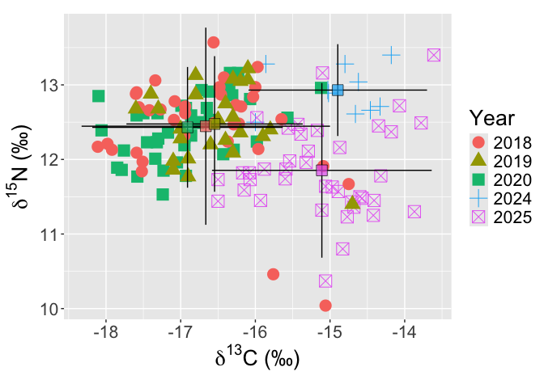
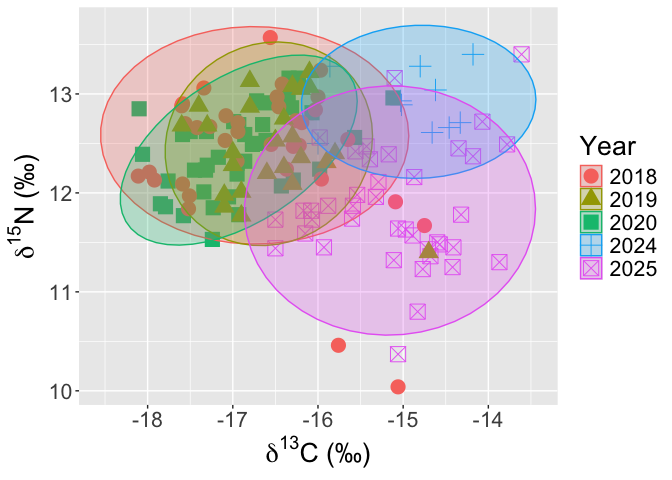

# SIA exploratory


## Intro

Stable isotopes….

## Load packages and save formatting preferences

## Input data and merge into one

``` r
lab_outputs<-read.csv("Lab_outputs.csv",header=TRUE)
head(lab_outputs)
```

      Lead Sample_type Sample_name     N      C N_wt C_wt C_N_wt  X X.1 X.2 X.3
    1   RB       Blood       RBC1a 11.11 -16.23 13.4 48.7    3.6 NA  NA  NA  NA
    2   RB       Blood       RBC3b 11.58 -16.16 14.2 48.6    3.4 NA  NA  NA  NA
    3   RB       Blood       RBC4a 10.93 -15.70 13.8 47.7    3.5 NA  NA  NA  NA
    4   RB       Blood       RBC5a 11.23 -17.09 14.0 48.3    3.4 NA  NA  NA  NA
    5   RB       Blood       RBC7a 10.94 -17.65 13.9 48.3    3.5 NA  NA  NA  NA
    6   RB       Blood       RBC8a 11.87 -15.89 14.2 48.6    3.4 NA  NA  NA  NA

``` r
lab_outputs <- lab_outputs[, 1:(ncol(lab_outputs) - 4)]

metadata<-read.csv("Metadata.csv",header=TRUE)
metadata <- metadata[, 1:(ncol(metadata) - 88)]

lab_outputs <- lab_outputs %>%
  mutate(Sample_ID = case_when(
    Sample_type == "Blood" ~ sub("^RBC([0-9]+)[a-zA-Z]$", "\\1", Sample_name), 
    Sample_type == "Skin"  ~ Sample_name,                       
    TRUE ~ Sample_name
  ))
head(lab_outputs)
```

      Lead Sample_type Sample_name     N      C N_wt C_wt C_N_wt Sample_ID
    1   RB       Blood       RBC1a 11.11 -16.23 13.4 48.7    3.6         1
    2   RB       Blood       RBC3b 11.58 -16.16 14.2 48.6    3.4         3
    3   RB       Blood       RBC4a 10.93 -15.70 13.8 47.7    3.5         4
    4   RB       Blood       RBC5a 11.23 -17.09 14.0 48.3    3.4         5
    5   RB       Blood       RBC7a 10.94 -17.65 13.9 48.3    3.5         7
    6   RB       Blood       RBC8a 11.87 -15.89 14.2 48.6    3.4         8

``` r
blood_labs <- lab_outputs %>%
  filter(Sample_type == "Blood") %>%
  mutate(Sample_ID = as.integer(Sample_ID)) %>%
  left_join(metadata %>% select(Blood_RB, Sex, Life_stage, Date),
            by = c("Sample_ID" = "Blood_RB")) %>%
  mutate(Sample_ID = as.character(Sample_ID))

skin_labs <- lab_outputs %>%
  filter(Sample_type == "Skin") %>%
  left_join(metadata %>% select(Biopsy_no, Genetics_no, Sex, Life_stage, Date) %>%
              pivot_longer(c(Biopsy_no, Genetics_no), values_to = "Sample_ID") %>%
              select(-name),
            by = "Sample_ID")

SIA_full <- bind_rows(blood_labs, skin_labs) %>%
  select(-Sample_ID)

SIA_full <- SIA_full %>%
  mutate(
    Month = month(Date),
    Season = if_else(Month %in% 11:12 | Month %in% 1:4, "Wet", "Dry")
  )
SIA_full$Date <- as.Date(SIA_full$Date, format = "%d/%m/%Y")
SIA_full$Year <- year(SIA_full$Date)
SIA_full$Year <- as.factor(SIA_full$Year)

head(SIA_full)
```

      Lead Sample_type Sample_name     N      C N_wt C_wt C_N_wt Sex Life_stage
    1   RB       Blood       RBC1a 11.11 -16.23 13.4 48.7    3.6   M      Adult
    2   RB       Blood       RBC3b 11.58 -16.16 14.2 48.6    3.4   M      Adult
    3   RB       Blood       RBC4a 10.93 -15.70 13.8 47.7    3.5   M      Adult
    4   RB       Blood       RBC5a 11.23 -17.09 14.0 48.3    3.4   F      Adult
    5   RB       Blood       RBC7a 10.94 -17.65 13.9 48.3    3.5   M      Adult
    6   RB       Blood       RBC8a 11.87 -15.89 14.2 48.6    3.4   M      Adult
            Date Month Season Year
    1 2024-08-12     8    Dry 2024
    2 2024-08-15     8    Dry 2024
    3 2024-08-16     8    Dry 2024
    4 2024-08-17     8    Dry 2024
    5 2024-08-17     8    Dry 2024
    6 2024-08-18     8    Dry 2024

## Summmary table by sample type

``` r
SIA_full %>%
  group_by(Sample_type, Sex, Season) %>%
  summarise(
    mean_C = round(mean(C, na.rm = TRUE), 2),
    sd_C   = round(sd(C, na.rm = TRUE), 2),
    mean_N = round(mean(N, na.rm = TRUE), 2),
    sd_N   = round(sd(N, na.rm = TRUE), 2),
    n      = n(),
    .groups = "drop"
  )
```

    # A tibble: 8 × 8
      Sample_type Sex   Season mean_C  sd_C mean_N  sd_N     n
      <chr>       <chr> <chr>   <dbl> <dbl>  <dbl> <dbl> <int>
    1 Blood       F     Dry     -16.7  0.32   10.6  0.38    13
    2 Blood       F     Wet     -16.6  0.23   10.7  0.37    14
    3 Blood       M     Dry     -16.3  0.6    11.4  0.31    15
    4 Blood       M     Wet     -16.4  0.59   11.0  0.5      9
    5 Skin        F     Dry     -16.6  0.79   12.4  0.46    73
    6 Skin        F     Wet     -15.6  1.05   12.0  0.8     21
    7 Skin        M     Dry     -16.1  1.05   12.5  0.65    45
    8 Skin        M     Wet     -15.3  1.34   12.2  0.68    15

## Exploring inter-annual trends in biopsy data

``` r
SIA_biopsy<-SIA_full[SIA_full$Sample_type=="Skin",]

SIA_full %>%
  group_by(Year, Sex) %>%
  summarise(mean_C = mean(C, na.rm = TRUE),
            se_C = sd(C, na.rm = TRUE) / sqrt(n()),
            n = n(),
            .groups = "drop") %>%
  ggplot(aes(x = Year, y = mean_C, colour = Sex, group = Sex)) +
  geom_point(size = 5) +
  geom_errorbar(aes(ymin = mean_C - se_C, ymax = mean_C + se_C), width = 0.3, alpha = 0.6)+
  scale_colour_manual(values = c("#4A90C4", "darkgreen")) +
  labs(
    x = "Year",
    y = "Mean dC",
    colour = "Season"
  ) +
  my_theme + 
  theme(axis.text.x = element_text(angle = 45, hjust = 1))
```


``` r
SIA_full %>%
  group_by(Year, Sex) %>%
  summarise(mean_N = mean(N, na.rm = TRUE),
            se_N = sd(N, na.rm = TRUE) / sqrt(n()),
            n = n(),
            .groups = "drop") %>%
  ggplot(aes(x = Year, y = mean_N, colour = Sex, group = Sex)) +
  geom_point(size = 5) +
  geom_errorbar(aes(ymin = mean_N - se_N, ymax = mean_N + se_N), width = 0.3, alpha = 0.6)+
  scale_colour_manual(values = c("#4A90C4", "darkgreen")) +  
  labs(
    x = "Year",
    y = "Mean dN",
    colour = "Season"
  ) +
  my_theme + 
  theme(axis.text.x = element_text(angle = 45, hjust = 1))
```


## Isoscape plots by year

``` r
first.plot <- ggplot(data = SIA_biopsy, 
                   mapping = aes(x = C, 
                                 y = N)) + 
  geom_point(aes(color = Year, shape = Year), size = 5) +
  ylab(expression(paste(delta^{15}, "N (\u2030)"))) +
  xlab(expression(paste(delta^{13}, "C (\u2030)"))) + 
  theme(text = element_text(size=20))

classic.first.plot <- first.plot + theme_classic() + 
  theme(text = element_text(size=35)) + 
  coord_equal() + 
  theme(axis.ticks.length = unit(-0.2, "cm")) +
  scale_colour_viridis_d(end = 0.9)
print(classic.first.plot)
```


``` r
fbmeans <- SIA_biopsy %>% 
  group_by(Year) %>% 
  summarise(count = n(),
            mC = mean(C), 
            sdC = sd(C), 
            mN = mean(N), 
            sdN = sd(N) )
print(fbmeans)
```

    # A tibble: 5 × 6
      Year  count    mC   sdC    mN   sdN
      <fct> <int> <dbl> <dbl> <dbl> <dbl>
    1 2018     37 -16.7 0.849  12.4 0.675
    2 2019     26 -16.5 0.602  12.5 0.464
    3 2020     41 -16.9 0.651  12.4 0.413
    4 2024     10 -14.9 0.610  12.9 0.314
    5 2025     40 -15.1 0.750  11.9 0.598

``` r
second.plot <- first.plot + 
  geom_errorbar(data = fbmeans, 
                mapping = aes(x = mC, y = mN,
                              ymin = mN - 1.96*sdN, 
                              ymax = mN + 1.96*sdN), 
                width = 0)+
  geom_errorbarh(data = fbmeans, 
                 mapping = aes(x = mC, y = mN,
                               xmin = mC - 1.96*sdC,
                               xmax = mC + 1.96*sdC),
                 height = 0) + 
  geom_point(data = fbmeans, aes(x = mC, 
                                 y = mN,
                                 fill = Year), 
             color = "black", shape = 22, size = 5,
             alpha = 0.7, show.legend = FALSE) + 
  coord_equal()
```

    Warning: `geom_errorbarh()` was deprecated in ggplot2 4.0.0.
    ℹ Please use the `orientation` argument of `geom_errorbar()` instead.

``` r
print(second.plot)
```

    `height` was translated to `width`.



``` r
p.ell <- 0.95

ellipse.plot3 <- first.plot + 
  stat_ellipse(aes(group =Year, 
                   fill = Year, 
                   color = Year), 
               alpha = 0.25, 
               level = p.ell,
               type = "t",
               geom = "polygon")
print(ellipse.plot3)
```



## Isoscape plots by sex

``` r
first.plot <- ggplot(data = SIA_biopsy, 
                   mapping = aes(x = C, 
                                 y = N)) + 
  geom_point(aes(color = Sex, shape = Sex), size = 5) +
  ylab(expression(paste(delta^{15}, "N (\u2030)"))) +
  xlab(expression(paste(delta^{13}, "C (\u2030)"))) + 
  theme(text = element_text(size=20))

classic.first.plot <- first.plot + theme_classic() + 
  theme(text = element_text(size=35)) + 
  coord_equal() + 
  theme(axis.ticks.length = unit(-0.2, "cm")) +
  scale_colour_viridis_d(end = 0.9)
print(classic.first.plot)
```


``` r
fbmeans <- SIA_biopsy %>% 
  group_by(Sex) %>% 
  summarise(count = n(),
            mC = mean(C), 
            sdC = sd(C), 
            mN = mean(N), 
            sdN = sd(N) )
print(fbmeans)
```

    # A tibble: 2 × 6
      Sex   count    mC   sdC    mN   sdN
      <chr> <int> <dbl> <dbl> <dbl> <dbl>
    1 F        94 -16.4 0.958  12.3 0.576
    2 M        60 -15.9 1.16   12.4 0.663

``` r
second.plot <- first.plot + 
  geom_errorbar(data = fbmeans, 
                mapping = aes(x = mC, y = mN,
                              ymin = mN - 1.96*sdN, 
                              ymax = mN + 1.96*sdN), 
                width = 0)+
  geom_errorbarh(data = fbmeans, 
                 mapping = aes(x = mC, y = mN,
                               xmin = mC - 1.96*sdC,
                               xmax = mC + 1.96*sdC),
                 height = 0) + 
  geom_point(data = fbmeans, aes(x = mC, 
                                 y = mN,
                                 fill = Sex), 
             color = "black", shape = 22, size = 5,
             alpha = 0.7, show.legend = FALSE) + 
  coord_equal()
print(second.plot)
```

    `height` was translated to `width`.


``` r
p.ell <- 0.95

ellipse.plot3 <- first.plot + 
  stat_ellipse(aes(group =Sex, 
                   fill = Sex, 
                   color = Sex), 
               alpha = 0.25, 
               level = p.ell,
               type = "t",
               geom = "polygon")
print(ellipse.plot3)
```


